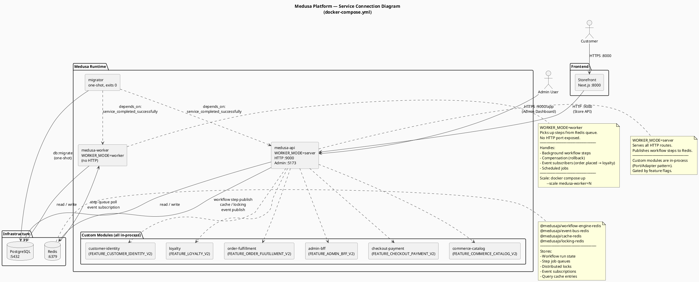

# Architecture Roadmap: Base Medusa → SCS-based Platform

## 1. Overview

This document describes the evolutionary path from a vanilla Medusa installation to the
upgrade-safe, service-coordinated platform architecture implemented in this repository.

---

## 2. Baseline: Vanilla Medusa (Modular Monolith)

```
┌──────────────────────────────────────────────────────────────────┐
│  Single Node.js Process                                          │
│                                                                  │
│  HTTP Server (:9000)                                             │
│  ┌────────┐ ┌────────┐ ┌──────────┐ ┌────────┐ ┌────────────┐  │
│  │product │ │ order  │ │ customer │ │ cart   │ │ fulfillment│  │
│  │module  │ │ module │ │ module   │ │ module │ │ module     │  │
│  └────────┘ └────────┘ └──────────┘ └────────┘ └────────────┘  │
│               DI Container (in-process, shared)                  │
│                                                                  │
│  Workflow Engine (in-memory)                                     │
│  Event Bus (in-memory)                                           │
│  Cache (in-memory)                                               │
└──────────────────────────────────┬───────────────────────────────┘
                                   │
                          ┌────────▼───────┐
                          │  PostgreSQL    │
                          └────────────────┘
```

**Characteristics:**
- Single deployable unit
- No Redis required
- In-memory workflow state (lost on restart)
- All modules in-process

---

## 3. Phase 1: Redis Infrastructure (Production-Ready)

Replace in-memory providers with Redis-backed equivalents.

```
┌──────────────────────────────────────────────────────────────────┐
│  Single Node.js Process                                          │
│                                                                  │
│  HTTP Server (:9000)                                             │
│  ┌────────┐ ┌────────┐ ┌──────────┐ ┌────────┐ ┌────────────┐  │
│  │product │ │ order  │ │ customer │ │ cart   │ │ fulfillment│  │
│  └────────┘ └────────┘ └──────────┘ └────────┘ └────────────┘  │
│                                                                  │
│  @medusajs/workflow-engine-redis ──────────────────┐            │
│  @medusajs/event-bus-redis     ────────────────────┤            │
│  @medusajs/cache-redis         ────────────────────┤            │
│  @medusajs/locking-redis       ────────────────────┤            │
└──────────────────────────────────┬─────────────────┼────────────┘
                                   │                 │
                          ┌────────▼───────┐  ┌──────▼──────┐
                          │  PostgreSQL    │  │    Redis    │
                          └────────────────┘  └─────────────┘
```

**Changes from baseline:**
- `medusa-config.ts` registers 4 Redis modules
- `REDIS_URL` env variable required
- Workflow state survives restarts
- Distributed locking prevents race conditions

---

## 4. Phase 2: Multi-Instance (API + Worker Split)

Split the single instance into an HTTP server and a background worker.

```
                        ┌─────────────────────────────┐
  Browser / Storefront  │                             │
         │              │   medusa-api                │
         │  HTTP :9000  │   WORKER_MODE=server        │
         └─────────────▶│   - Serves all HTTP routes  │
                        │   - Admin dashboard :5173   │
                        │   - Publishes workflow steps │
                        │     to Redis queue           │
                        └──────────────┬──────────────┘
                                       │
                           ┌───────────▼────────────┐
                           │         Redis          │
                           │  ┌────────────────┐    │
                           │  │ Workflow state  │    │
                           │  │ Step queues     │    │
                           │  │ Distributed lock│    │
                           │  │ Event bus       │    │
                           │  └────────────────┘    │
                           └───────────┬────────────┘
                                       │
                        ┌──────────────▼──────────────┐
                        │   medusa-worker             │
                        │   WORKER_MODE=worker        │
                        │   - No HTTP                 │
                        │   - Pulls steps from queue  │
                        │   - Executes background     │
                        │     workflow steps          │
                        │   - Runs compensations      │
                        └──────────────┬──────────────┘
                                       │
                           ┌───────────▼────────────┐
                           │      PostgreSQL         │
                           │   (shared by both)      │
                           └────────────────────────┘
```

**Container summary:**

| Container | Role | Port |
|---|---|---|
| `migrator` | One-shot DB migration runner | — |
| `medusa-api` | HTTP + Admin (WORKER_MODE=server) | 9000, 5173 |
| `medusa-worker` | Background step executor (WORKER_MODE=worker) | — |
| `storefront` | Next.js customer-facing app | 8000 |
| `postgres` | Persistent data store | 5432 |
| `redis` | Workflow state + event bus | 6379 |

---

## 5. Phase 3: Upgrade-Safe Custom Module Architecture (Current State)

Custom domains use a **Port/Adapter pattern** to isolate Medusa coupling.

```
┌──────────────────────────────────────────────────────────────────────┐
│  Custom Module: e.g. checkout-payment                                │
│                                                                      │
│  ┌─────────────────────────────────────────────────────────────┐    │
│  │  Port (Stable interface — never depends on Medusa)          │    │
│  │  ports/checkout-payment.contract.ts                         │    │
│  │  interface CheckoutPaymentContract { ... }                  │    │
│  └────────────────────────────┬────────────────────────────────┘    │
│                               │ implements                           │
│  ┌────────────────────────────▼────────────────────────────────┐    │
│  │  Adapter (Medusa implementation — upgradeable independently) │    │
│  │  adapters/medusa/checkout-payment.medusa-adapter.ts         │    │
│  │  class CheckoutPaymentMedusaAdapter implements Contract      │    │
│  └─────────────────────────────────────────────────────────────┘    │
│                                                                      │
│  __tests__/contract.spec.ts  ← tested against the contract only     │
└──────────────────────────────────────────────────────────────────────┘
```

**Upgrade safety mechanisms:**

| Mechanism | File | Purpose |
|---|---|---|
| Version lock check | `scripts/check-medusa-version-consistency.mjs` | All `@medusajs/*` at same version |
| Boundary lint | `.eslintrc.js` override for `apps/backend` | Block private Medusa imports |
| Contract type check | `apps/backend/package.json` `test:contract` | Ensure adapters satisfy contracts |
| Feature flags | `src/shared/feature-flags.ts` | Toggle risky features without re-deploy |
| One migration runner | `migrator` Docker service | Prevent double-apply on multi-instance upgrade |
| CI smoke | `scripts/ci-smoke.sh` | Single command: version + lint + typecheck + build |

---

## 6. Full System Context (C4 Level 1 — System Context)



---

## 7. Custom Module Architecture (C4 Level 2 — Container)

**Directory structure:**

```
apps/backend/src/modules/
├── admin-bff/               BFF for admin dashboard custom logic
│   ├── ports/               Stable interface (no Medusa imports)
│   ├── adapters/medusa/     Medusa-specific implementation
│   └── __tests__/           Contract tests (tsc --noEmit)
│
├── checkout-payment/        Custom checkout + payment orchestration
│   ├── ports/
│   ├── adapters/medusa/
│   └── __tests__/
│
├── commerce-catalog/        Extended catalog features
│   ├── ports/
│   ├── adapters/medusa/
│   └── __tests__/
│
├── customer-identity/       Customer auth + profile domain
│   ├── ports/
│   ├── adapters/medusa/
│   └── __tests__/
│
├── loyalty/                 Loyalty points and rewards domain
│   ├── ports/
│   ├── adapters/medusa/
│   └── __tests__/
│
└── order-fulfillment/       Order lifecycle + fulfillment domain
    ├── ports/
    ├── adapters/medusa/
    └── __tests__/
```

**Port/Adapter pattern (applied to all 6 modules):**

```plantuml
@startuml Module Adapter Pattern

skinparam classStyle rectangle
skinparam backgroundColor #FAFAFA
skinparam defaultFontSize 12
skinparam ArrowColor #444444

title Custom Module — Port/Adapter Pattern\nApplied to all 6 modules

package "Pattern (applies to each module)" {

  interface "«contract»\nModuleContract" as Contract {
    + healthCheck(): Promise<{module, status}>
    + ... domain operations ...
  }

  class "«adapter»\nModuleMedusaAdapter" as Adapter {
    - container: MedusaContainer
    + healthCheck(): Promise<{module, status}>
    + ... Medusa-backed implementations ...
  }

  Adapter ..|> Contract : implements

  note top of Contract
    ports/<module>.contract.ts
    ─────────────────────────
    • Pure TypeScript interface
    • Zero Medusa imports
    • Stable across upgrades
    • What consumers depend on
  end note

  note top of Adapter
    adapters/medusa/<module>.medusa-adapter.ts
    ─────────────────────────────────────────
    • Implements Contract
    • Uses @medusajs/* public APIs only
    • No */dist/* or */src/* imports
    • Swappable (mock, stub, v2)
  end note
}

package "6 Custom Modules" {
  class admin_bff       << (M,#ADD8E6) admin-bff >>
  class checkout_pmt    << (M,#ADD8E6) checkout-payment >>
  class catalog         << (M,#ADD8E6) commerce-catalog >>
  class identity        << (M,#ADD8E6) customer-identity >>
  class loyalty         << (M,#ADD8E6) loyalty >>
  class fulfillment     << (M,#ADD8E6) order-fulfillment >>
}

package "Feature Flags (src/shared/feature-flags.ts)" {
  class FeatureFlags {
    + adminBffV2: boolean
    + checkoutPaymentV2: boolean
    + commerceCatalogV2: boolean
    + customerIdentityV2: boolean
    + loyaltyV2: boolean
    + orderFulfillmentV2: boolean
  }
}

package "Medusa Runtime (in-process DI container)" {
  component [workflow-engine-redis] as wf
  component [event-bus-redis] as eb
  component [cache-redis] as cache
  component [locking-redis] as lock
}

Adapter ..> wf    : resolves from container
Adapter ..> eb    : resolves from container
Adapter ..> cache : resolves from container
Adapter ..> lock  : resolves from container

FeatureFlags ..> Adapter : gates\nactivation

admin_bff    --|> Adapter
checkout_pmt --|> Adapter
catalog      --|> Adapter
identity     --|> Adapter
loyalty      --|> Adapter
fulfillment  --|> Adapter

@enduml
```

---

## 8. Upgrade Runbook

```
Before upgrading @medusajs/* packages:

1. □ Read release notes — check for breaking changes in:
     - @medusajs/medusa  (API routes, middleware)
     - @medusajs/framework  (types, utils, HTTP helpers)
     - @medusajs/core-flows  (workflow step signatures, compensation functions)

2. □ Wait for in-flight workflows to complete (or accept they will be retried):
     # Check for active workflow runs before proceeding:
     docker compose exec redis redis-cli KEYS "wf:*" | wc -l
     # Only flush Redis if you are certain no workflows are in flight:
     # docker compose exec redis redis-cli FLUSHDB   ← ⚠ DESTRUCTIVE — loses all workflow state

3. □ Stop all containers:
     yarn docker:down

4. □ Update ALL @medusajs/* to the same new version:
     yarn up "@medusajs/*@X.Y.Z"

5. □ Run the full upgrade-safety pipeline:
     yarn verify:upgrade-safety
     # This runs in order:
     #   check:medusa-versions  — all @medusajs/* at same version
     #   lint:backend-boundaries — no private Medusa imports
     #   test:backend:contracts  — adapters satisfy contracts (tsc --noEmit)
     #   build:backend           — full TypeScript build succeeds

6. □ Rebuild images and run one-shot migrator first:
     docker compose up --build migrator
     # Wait for migrator to exit 0 before proceeding

7. □ Start remaining services:
     docker compose up -d medusa-api medusa-worker storefront

8. □ Verify health:
     curl http://localhost:9000/health
     # expected: { "status": "ok" }
```

> **Upgrade impact per module:**
>
> | Module | Watch for |
> |---|---|
> | `checkout-payment` | `@medusajs/core-flows` checkout hook signatures |
> | `commerce-catalog` | `@medusajs/product` data model, query `fields` paths |
> | `customer-identity` | `@medusajs/auth` provider API, `AuthenticatedMedusaRequest` type |
> | `loyalty` | Plugin version must match `@medusajs/*` release train |
> | `order-fulfillment` | Compensation function signatures, order state machine |
> | `admin-bff` | `@medusajs/framework` HTTP helper changes |

---

## 9. Development vs Production Mode

The Docker stack in this repository runs in **development mode** (`medusa develop`),
which rebuilds on file changes and is suitable for local development.

**Development (default):**
```bash
yarn docker:up            # starts all containers in watch mode
# start.sh runs: medusa develop  (hot-reload, source maps)
```

**Production:**
For a production deployment:
1. Add `RUN yarn build` to the `Dockerfile` (builds the app into `.medusa/server/`)
2. Change `start.sh` to run `yarn start` instead of `yarn dev`
3. Remove volume mounts from `docker-compose.yml` (no live source reload)
4. Set all `*_SECRET` env variables to strong random values

The Port/Adapter pattern and feature flags work identically in both modes.
