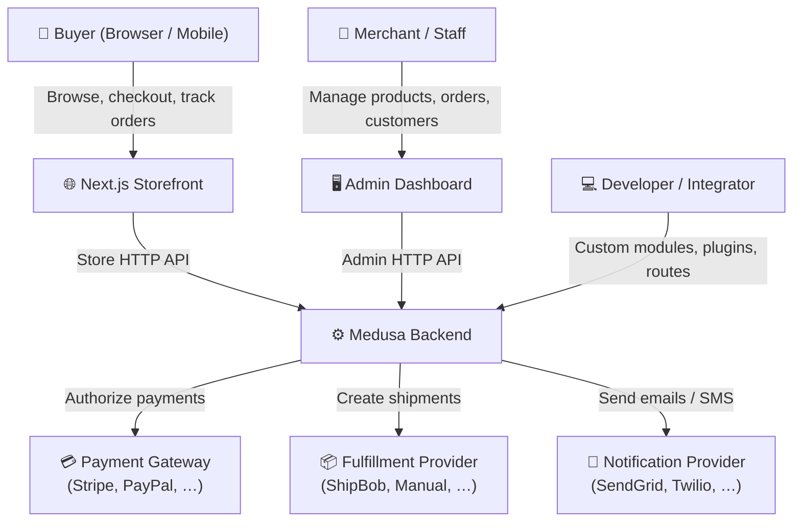
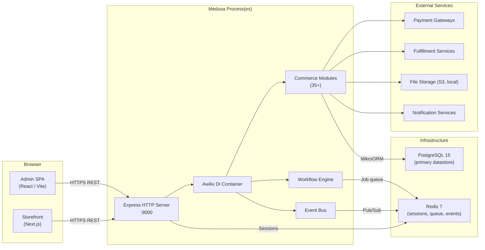
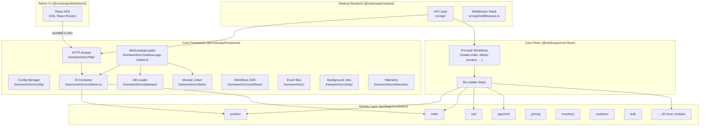
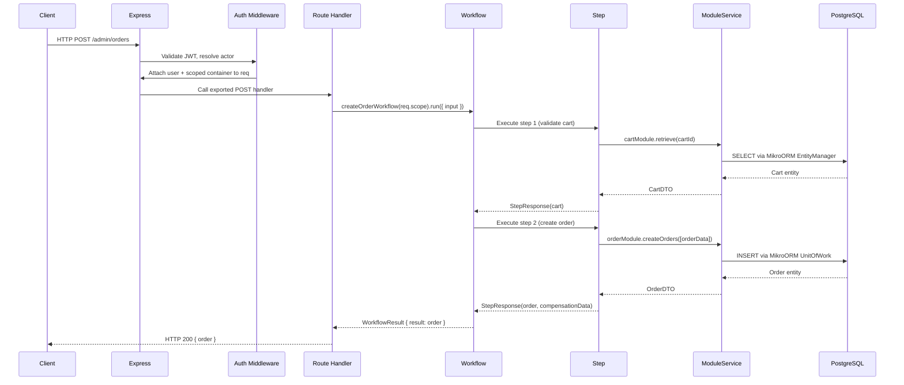
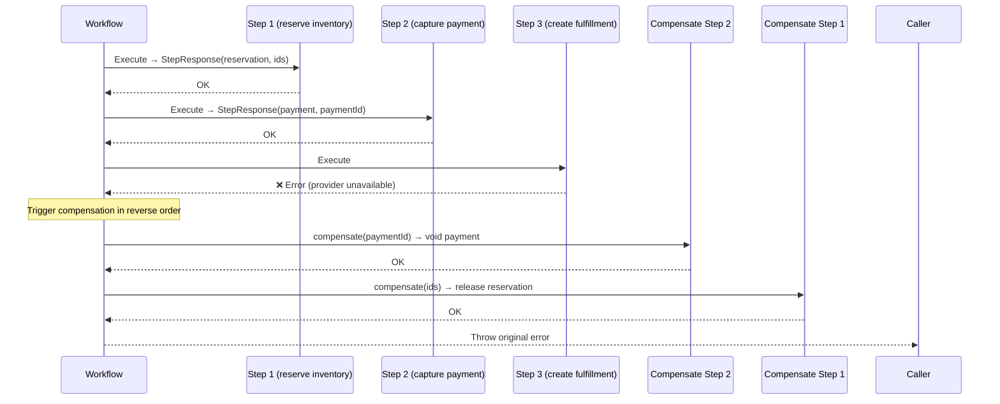
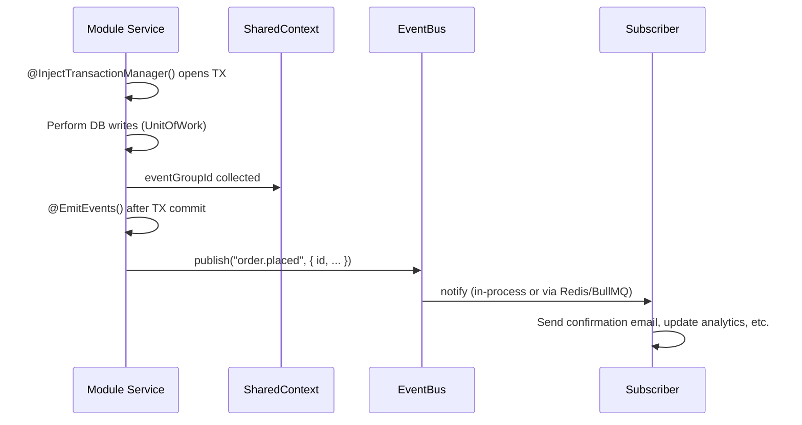
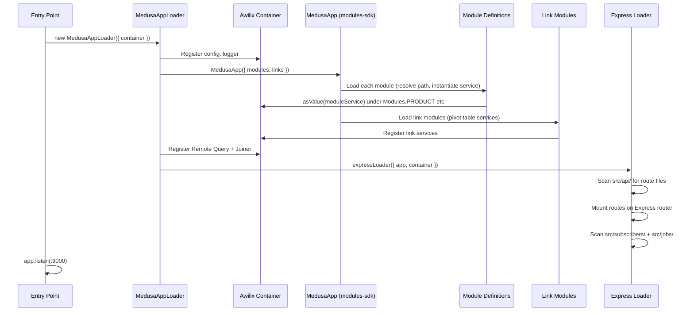
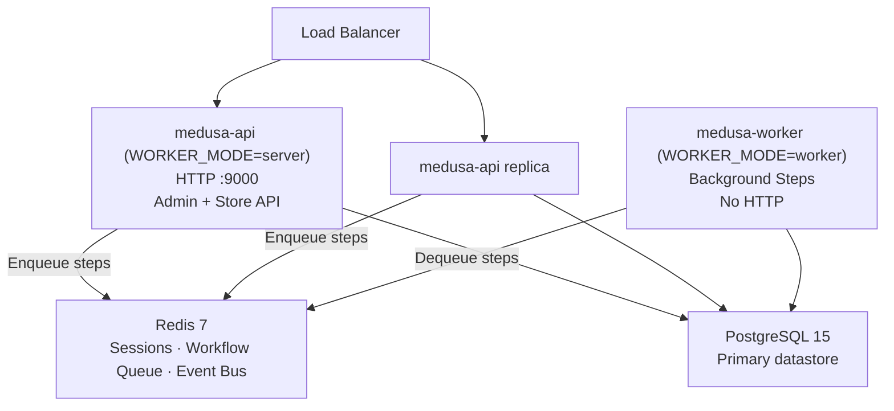

# Medusa v2.15.4 — arc42 Architecture Documentation

> **Version:** 2.15.4  
> **Architecture Style:** Modular monolith with event-driven capabilities  
> **Document Standard:** arc42 (https://arc42.org)

---

## Table of Contents

1. [Introduction and Goals](#1-introduction-and-goals)
2. [Architecture Constraints](#2-architecture-constraints)
3. [System Scope and Context](#3-system-scope-and-context)
4. [Solution Strategy](#4-solution-strategy)
5. [Building Block View](#5-building-block-view)
6. [Runtime View](#6-runtime-view)
7. [Deployment View](#7-deployment-view)
8. [Crosscutting Concepts](#8-crosscutting-concepts)
9. [Architecture Decisions](#9-architecture-decisions)
10. [Quality Requirements](#10-quality-requirements)
11. [Risks and Technical Debt](#11-risks-and-technical-debt)
12. [Glossary](#12-glossary)

---

## 1. Introduction and Goals

### 1.1 Purpose

Medusa is an open-source, headless commerce platform designed for developers who need a highly customizable and extensible backend for e-commerce applications. Version 2.x represents a complete architectural rewrite from v1, replacing a tightly coupled monolithic Express application with a composable, module-based system. Merchants get a fully functional commerce engine out of the box; developers get a platform they can extend, replace, or augment at every layer.

The platform exposes:
- A RESTful HTTP API (admin and store namespaces)
- A React-based admin dashboard (`@medusajs/dashboard`)
- A workflow engine for orchestrating business logic
- 35+ composable commerce modules (product, order, cart, pricing, payment, etc.)
- A provider abstraction for pluggable third-party integrations (payment gateways, fulfillment providers, notification services, etc.)

### 1.2 Stakeholders

| Stakeholder | Role | Primary Concern |
|---|---|---|
| **Merchants** | End users of the admin dashboard | Reliable, performant commerce operations; intuitive UI |
| **Storefront Developers** | Consumers of the Store API | Stable, well-documented REST API; SDK support |
| **Backend Developers / Integrators** | Extend modules, add custom workflows | Clean extension points; strong TypeScript types; DI container |
| **DevOps / Platform Engineers** | Deploy and operate the platform | Docker support; horizontal scalability; Redis for queue/session |
| **OSS Contributors** | Contribute to the platform | Clean code conventions; comprehensive test suite; CLAUDE.md guide |
| **Medusa Cloud Team** | SaaS hosting layer on top of Medusa | Multi-tenancy; telemetry; RBAC; stable internal APIs |

### 1.3 Quality Goals

The following quality goals are listed in descending priority:

| Priority | Quality Goal | Motivation |
|---|---|---|
| 1 | **Modularity** | Commerce domains (product, order, cart) are independently deployable and replaceable modules |
| 2 | **Extensibility** | Developers can add custom modules, workflows, API routes, and providers without forking the core |
| 3 | **Developer Experience** | TypeScript-first design with strong type inference, clear conventions, and minimal boilerplate |
| 4 | **Scalability** | Supports scale-out via worker/server process split and Redis-backed event bus and workflow engine |
| 5 | **Reliability** | Workflow compensation (saga pattern) ensures consistent state across multi-step operations |
| 6 | **Testability** | DI container enables unit and integration testing; test utilities are part of the platform |

---

## 2. Architecture Constraints

### 2.1 Technical Constraints

| Constraint | Detail |
|---|---|
| **Runtime** | Node.js ≥ 20 (LTS) |
| **Language** | TypeScript (ES2021 target, Node16 module resolution) |
| **Database** | PostgreSQL (≥ 15 recommended); MikroORM is the only supported ORM |
| **Package Manager** | Yarn 3.2.1 with `node-modules` linker |
| **Build System** | Turborepo (task graph caching and parallelism across workspace packages) |
| **HTTP Framework** | Express.js — hardcoded as the HTTP layer; not pluggable |
| **Session Store** | Redis (optional in dev, required for multi-instance production deployments) |
| **Workflow Queue** | Redis (required when using `workflow-engine-redis` module) |
| **Admin UI** | React 18 + Vite — served from the same process in development, compiled to static assets for production |

### 2.2 Organizational Constraints

- All source code is in the public GitHub monorepo `medusajs/medusa`.
- Changes to the public API surface must be backward compatible within a minor version.
- The `packages/core/` sub-tree is considered a stable internal framework; changes require cross-team review.
- The `CONTRIBUTING.md` and `CLAUDE.md` files define the contribution workflow and code conventions that all contributors must follow.

### 2.3 Coding Conventions

- **File naming:** kebab-case (`define-config.ts`, `order-module-service.ts`)
- **Types / Classes / Interfaces:** PascalCase
- **Functions / Variables:** camelCase
- **Database columns:** snake_case
- **Constants:** SCREAMING_SNAKE_CASE
- **Formatting:** Prettier — no semicolons, double quotes, 2-space indent, ES5 trailing commas
- **Exports:** Barrel re-exports via `export * from` in every `index.ts`
- **Error handling:** `MedusaError` with typed error categories — never raw `Error` throws in business logic
- **Path aliases** inside each package: `@models`, `@types`, `@services`, `@repositories`, `@utils`

---

## 3. System Scope and Context

### 3.1 Business Context

The following diagram shows the major external actors and their interactions with the Medusa platform:



### 3.2 Technical Context



### 3.3 External Interfaces

| Interface | Protocol | Direction | Description |
|---|---|---|---|
| Store REST API | HTTPS / JSON | Inbound | Public API for storefronts; routes under `/store/` |
| Admin REST API | HTTPS / JSON | Inbound | Authenticated API for merchants; routes under `/admin/` |
| Auth API | HTTPS / JSON | Inbound | JWT and session-based authentication under `/auth/` |
| Payment Provider | HTTPS / JSON | Outbound | Calls to payment gateway SDKs (Stripe, etc.) |
| Fulfillment Provider | HTTPS / JSON | Outbound | Shipment creation and tracking |
| File Storage | HTTPS / S3 | Outbound | Upload/download of product images and files |
| Notification Provider | HTTPS / SMTP | Outbound | Email and SMS notifications (SendGrid, Postmark, etc.) |
| Redis | TCP / RESP | Bidirectional | Sessions, distributed locks, workflow queue, event bus |
| PostgreSQL | TCP | Bidirectional | Primary relational datastore for all modules |

---

## 4. Solution Strategy

### 4.1 Key Technology Decisions

| Decision | Technology | Rationale |
|---|---|---|
| Language | TypeScript | End-to-end type safety, strong ecosystem, IDE support |
| HTTP Framework | Express.js | Mature, simple, large middleware ecosystem; file-system route loading added on top |
| ORM | MikroORM | Excellent TypeScript support, PostgreSQL-first, Unit-of-Work pattern |
| DI Container | Awilix | Lightweight, TypeScript-compatible IoC, supports scoped containers per request |
| Module system | Custom loader + interface contracts | Enables hot-swappable commerce domains |
| Workflow engine | Custom `createStep/createWorkflow` SDK | Declarative sagas with compensation, distributed execution via Redis |
| State management | Shared `Context` object | Passes transaction manager, event emitter, and metadata across module boundaries |
| Build system | Turborepo + Yarn workspaces | Parallel builds, remote caching, dependency-aware task graph |
| Admin UI | React + Vite | Fast HMR, modern tooling, embeddable within the main process in dev |

### 4.2 Top-Level Decomposition

The system is decomposed into four horizontal layers:

```
┌──────────────────────────────────────────────────────────┐
│                     API Layer                            │
│  Express routes (/admin/*, /store/*, /auth/*, /hooks/*)  │
├──────────────────────────────────────────────────────────┤
│                   Workflow Layer                          │
│  createWorkflow / createStep / compensation / hooks      │
├──────────────────────────────────────────────────────────┤
│                   Module Layer                           │
│  35+ domain modules (product, order, cart, payment, …)   │
├──────────────────────────────────────────────────────────┤
│                Core Framework Layer                      │
│  DI container, HTTP loader, DB connection, config,       │
│  event bus, module linker, telemetry, logger             │
└──────────────────────────────────────────────────────────┘
```

### 4.3 Approaches to Quality Goals

- **Modularity:** Each commerce domain lives in its own package under `packages/modules/`. Modules communicate only via injected service interfaces — never via direct imports between module implementations.
- **Extensibility:** The DI container allows third-party modules to register under standard keys. The provider pattern in modules (payment, fulfillment, notification, file) lets integrators plug in custom implementations with zero changes to core.
- **Developer Experience:** Full TypeScript types for every module service interface, HTTP request/response, and workflow step. Path aliases (`@models`, `@services`) reduce import verbosity inside packages.
- **Scalability:** The `WORKER_MODE` environment variable splits the same codebase into `server` (HTTP-only) and `worker` (queue-only) processes. Redis-backed event bus and workflow engine enable horizontal scaling.
- **Reliability:** The workflow SDK enforces a compensation function for every step, implementing the Saga pattern to guarantee rollback on partial failures.

---

## 5. Building Block View

### Level 1: System Decomposition



### Level 2: Module Internals

Every commerce module follows an identical internal structure:

```
packages/modules/<domain>/
├── src/
│   ├── index.ts                  # Module exports (service class, migrations, joiner config)
│   ├── services/
│   │   └── <domain>-module-service.ts   # extends MedusaService<T>
│   ├── models/
│   │   └── <entity>.ts           # MikroORM @Entity() decorated classes
│   ├── repositories/             # Optional custom DAL repositories
│   ├── migrations/               # MikroORM migration files
│   └── types/                    # Module-internal type definitions
└── integration-tests/
    └── __tests__/                # Module-level integration tests
```

**Module Interface Pattern:**

Every module exports a service class that implements a well-known interface from `@medusajs/framework/types`. Other modules and workflows depend on the interface, never the concrete class:

```typescript
// Interface (packages/core/types/src/)
export interface IProductModuleService extends IModuleService {
  listProducts(filters: FilterableProductProps, config?: FindConfig<ProductDTO>): Promise<ProductDTO[]>
  retrieveProduct(id: string, config?: FindConfig<ProductDTO>): Promise<ProductDTO>
  createProducts(data: CreateProductDTO[]): Promise<ProductDTO[]>
  // ...
}

// Implementation (packages/modules/product/src/services/)
export class ProductModuleService
  extends MedusaService<{ Product: { dto: ProductDTO } }>({ Product, ProductVariant, ... })
  implements IProductModuleService {
  // MedusaService<T> provides generic CRUD operations from MikroORM entities
}
```

**Module registration in `medusa-config.ts`:**

```typescript
import { defineConfig, Modules } from "@medusajs/framework/utils"

export default defineConfig({
  modules: [
    { resolve: "@medusajs/product", options: { ... } },
    { resolve: "./src/modules/my-custom-module" },
  ],
})
```

### Level 3: Key Components

#### 3a. DI Container (Awilix-based)

`packages/core/framework/src/container.ts` exports a singleton Awilix container created via `createMedusaContainer()` from `@medusajs/utils`. At startup, `MedusaAppLoader` registers:

- All module service instances (keyed by their module identifier, e.g., `Modules.PRODUCT`)
- Infrastructure services: `ContainerRegistrationKeys.LOGGER`, `ContainerRegistrationKeys.QUERY`, `ContainerRegistrationKeys.MANAGER`, etc.
- Config module, remote query, remote joiner

Per-request scoped containers are created by Express middleware, extending the root container with request-specific values (user context, request ID).

#### 3b. HTTP Layer (Express.js)

`packages/core/framework/src/http/` provides:

- **`express-loader.ts`** — bootstraps Express with cookie parser, session (optionally Redis-backed), Morgan logging, and compression middleware.
- **`routes-finder.ts`** — walks the `src/api/` directory tree and discovers route files following the Next.js-like file-system convention (folders map to URL segments; `[id]` folders map to `:id` params).
- **`routes-loader.ts`** — imports discovered route files and mounts exported `GET`, `POST`, `PUT`, `PATCH`, `DELETE` handler functions on the Express router.
- **`middleware-file-loader.ts`** — discovers and applies `middlewares.ts` files co-located with route directories.
- **`router.ts`** — orchestrates route and middleware loading into the Express app.

Route files export named HTTP-method handlers:

```typescript
// packages/medusa/src/api/admin/products/route.ts
export const GET = async (req: AuthenticatedMedusaRequest, res: MedusaResponse) => { ... }
export const POST = async (req: AuthenticatedMedusaRequest, res: MedusaResponse) => { ... }
```

The API surface is organized into three namespaces:

| Namespace | Path Prefix | Authentication |
|---|---|---|
| Admin API | `/admin/` | JWT Bearer token (admin user) |
| Store API | `/store/` | Optional JWT (customer) or anonymous |
| Auth API | `/auth/` | None (issues tokens) |

#### 3c. Workflow Engine

The workflow SDK (`packages/core/workflows-sdk/`) provides a declarative, saga-aware orchestration layer:

- **`createStep(id, mainFn, compensationFn?)`** — defines an atomic unit of work with optional rollback logic. Steps return `StepResponse(result, compensationData)`.
- **`createWorkflow(id, composerFn)`** — composes steps into a directed acyclic graph. The composer function runs synchronously at definition time (no `await`) to build a static execution plan.
- **`transform()`** — maps workflow data between steps without side effects.
- **`when()`** — conditionally branches execution.
- **`parallelize()`** — runs multiple steps concurrently.
- **`useQueryGraphStep()`** — fetches data from the Remote Query without writing a custom step.
- **`createHook()`** — defines extension points that developers can subscribe to without modifying the core workflow.

Two backend implementations are provided:
- `workflow-engine-inmemory` — for single-process development
- `workflow-engine-redis` — for distributed execution with durable step state

#### 3d. Event Bus

The event bus abstraction provides a publish/subscribe mechanism decoupled from the transport:

- `@EmitEvents()` decorator on service methods collects domain events during a transaction and publishes them after the transaction commits.
- Two implementations: `event-bus-local` (in-process, for dev/test) and `event-bus-redis` (BullMQ queues for production).
- Subscribers are discovered from `src/subscribers/` via file-system scanning at startup.

#### 3e. Module Linker (Remote Joiner)

`packages/core/framework/src/links/` implements cross-module relationships without foreign keys:

- **Link modules** in `packages/modules/link-modules/` define pivot tables joining IDs from two different modules (e.g., `product_variant_inventory_item`).
- The **Remote Joiner** resolves multi-module queries declared as a graph (similar to GraphQL fragments) into SQL joins across module databases.
- `useQueryGraphStep()` in workflows and `req.scope.resolve(ContainerRegistrationKeys.QUERY)` in route handlers expose this graph query API.

---

## 6. Runtime View

### 6.1 HTTP Request Lifecycle



### 6.2 Workflow Compensation (Saga Pattern)



### 6.3 Event-Driven Flow



### 6.4 Module Loading Sequence at Startup



---

## 7. Deployment View

### 7.1 Single-Server Deployment (Development)

For local development, the entire Medusa backend runs as a single Node.js process (`WORKER_MODE=shared`):

```
┌──────────────────────────────────────────────┐
│  Node.js Process (WORKER_MODE=shared)         │
│  ┌────────────┐  ┌────────────┐              │
│  │ HTTP :9000 │  │ Workflow   │              │
│  │ (Express)  │  │ Engine     │              │
│  └────────────┘  └────────────┘              │
│  ┌────────────────────────────┐              │
│  │  Commerce Modules (35+)    │              │
│  └────────────────────────────┘              │
└──────────────────────────────────────────────┘
         │                  │
    PostgreSQL            Redis
    (optional in dev)
```

The admin dashboard is served with HMR via Vite at the same port.

### 7.2 Distributed Deployment with Redis

For production workloads, the same Docker image is started in two roles controlled by `WORKER_MODE`:



- `WORKER_MODE=server` — starts Express, serves HTTP, enqueues long-running workflow steps to Redis.
- `WORKER_MODE=worker` — skips Express, polls Redis queue, executes workflow steps.
- `WORKER_MODE=shared` — both roles in one process (dev / small deployments).

### 7.3 Docker Compose Setup

The provided `docker-compose.yml` defines five services:

| Service | Image | Purpose |
|---|---|---|
| `postgres` | `postgres:15-alpine` | Primary relational database |
| `redis` | `redis:7-alpine` | Sessions, workflow queue, event bus |
| `migrator` | App image | One-shot migration runner; exits after completion |
| `medusa-api` | App image | `WORKER_MODE=server`; exposes `:9000` (API) + `:5173` (HMR) |
| `medusa-worker` | App image | `WORKER_MODE=worker`; no exposed ports |
| `storefront` | App image | Next.js dev server; exposes `:8000` |

The `migrator` service uses a health-check dependency gate so API and worker containers only start after migrations succeed.

### 7.4 Environment Variables and Configuration

Key environment variables:

| Variable | Default | Description |
|---|---|---|
| `DATABASE_URL` | — | PostgreSQL connection string |
| `REDIS_URL` | — | Redis connection string |
| `JWT_SECRET` | — | Secret for signing JWT tokens |
| `COOKIE_SECRET` | — | Secret for signing session cookies |
| `WORKER_MODE` | `shared` | `server`, `worker`, or `shared` |
| `ADMIN_DISABLED` | `false` | Disables admin dashboard when `true` |
| `NODE_ENV` | `development` | Affects logging, CORS, cookie security |
| `PORT` | `9000` | HTTP listen port |

Application-level configuration is defined in `medusa-config.ts` using `defineConfig()`:

```typescript
import { defineConfig } from "@medusajs/framework/utils"

export default defineConfig({
  projectConfig: {
    databaseUrl: process.env.DATABASE_URL,
    redisUrl: process.env.REDIS_URL,
    http: { storeCors: "...", adminCors: "...", jwtSecret: "...", cookieSecret: "..." },
  },
  modules: [ /* module declarations */ ],
})
```

---

## 8. Crosscutting Concepts

### 8.1 Dependency Injection Pattern

Medusa uses Awilix for IoC. Every dependency — module services, logger, config, query — is resolved from the container rather than imported directly. This enables:

- **Testability:** Swap real services for mocks in unit tests by registering mock values before instantiation.
- **Extensibility:** Third-party modules register under standard keys; all consumers see the new implementation without code changes.
- **Request scoping:** Each HTTP request gets a child container scope, allowing per-request services (e.g., the current user) to be injected.

### 8.2 MedusaContext / SharedContext Pattern

All module service methods accept a final parameter `@MedusaContext() sharedContext: Context = {}`. The `Context` type carries:

- `transactionManager` — active MikroORM EntityManager for the current transaction (set by `@InjectTransactionManager()`)
- `manager` — read-only EntityManager (set by `@InjectManager()`)
- `eventGroupId` — groups events emitted within a single logical operation for deferred publishing
- `isolationLevel` — transaction isolation level override

This ensures that multi-step database operations across module boundaries share the same transaction without explicit passing.

### 8.3 Transaction Management

Two decorator patterns govern database transactions:

| Decorator | Scope | Typical Use |
|---|---|---|
| `@InjectManager()` | Provides a read EntityManager | Public-facing service methods that only read, or that orchestrate write sub-calls |
| `@InjectTransactionManager()` | Opens or joins a write transaction | Protected `_` methods that perform actual INSERT/UPDATE/DELETE |

The convention is: public methods use `@InjectManager()`, delegate to protected `_`-prefixed methods decorated with `@InjectTransactionManager()`:

```typescript
@InjectManager()
@EmitEvents()
async createOrder(data: CreateOrderDTO, @MedusaContext() ctx: Context = {}) {
  return await this.createOrder_(data, ctx)
}

@InjectTransactionManager()
protected async createOrder_(data: CreateOrderDTO, @MedusaContext() ctx: Context = {}) {
  // ctx.transactionManager is the active EntityManager here
  return await this.orderService_.create([data], ctx)
}
```

### 8.4 Error Handling

`MedusaError` (`@medusajs/framework/utils`) is the single error class used throughout business logic:

```typescript
import { MedusaError } from "@medusajs/framework/utils"

throw new MedusaError(MedusaError.Types.NOT_FOUND, `Product with id: ${id} was not found`)
throw new MedusaError(MedusaError.Types.INVALID_DATA, "Price must be greater than zero")
throw new MedusaError(MedusaError.Types.NOT_ALLOWED, "Cannot cancel a completed order")
```

The HTTP layer maps `MedusaError` types to HTTP status codes (404, 400, 403, etc.). Raw `Error` throws should only appear at the framework level for unrecoverable internal failures.

### 8.5 Event Emission

`@EmitEvents()` collects domain events declared inside a transaction and publishes them atomically after the transaction commits (transactional outbox pattern). Events carry an `eventGroupId` that groups related events for consumers needing to process them together.

Subscribers are plain async functions placed in `src/subscribers/`:

```typescript
// src/subscribers/order-placed.ts
export default async function handleOrderPlaced({ event, container }) {
  const notifModule = container.resolve(Modules.NOTIFICATION)
  await notifModule.createNotifications({ ... })
}
export const config = { event: "order.placed" }
```

### 8.6 Workflow Compensation (Saga Pattern)

Every workflow step can declare a compensation function. If any step throws, the workflow engine calls the compensation functions of all previously completed steps in reverse order. Compensation data is passed as the second argument to `StepResponse`:

```typescript
const reserveInventoryStep = createStep(
  "reserve-inventory",
  async (input, { container }) => {
    const ids = await inventoryModule.createReservations(input)
    return new StepResponse(ids, ids)          // result, compensationData
  },
  async (ids, { container }) => {              // compensationFn
    await inventoryModule.deleteReservations(ids)
  }
)
```

### 8.7 Database Access (MikroORM)

All entities are defined using MikroORM decorators (`@Entity()`, `@Property()`, `@ManyToOne()`, etc.) and stored in `src/models/`. The `MedusaService<T>` base class (from `@medusajs/framework/utils`) wraps the entity manager with generic CRUD methods:

- `list(filters, config)`, `listAndCount(...)`, `retrieve(id)`
- `create(data[])`, `update(id, data)`, `delete(ids)`
- `softDelete(ids)`, `restore(ids)`

Migrations are generated with MikroORM CLI and stored in `src/migrations/`. The `medusa db:migrate` command runs all pending migrations across all loaded modules.

### 8.8 Authentication and Authorization

- **Authentication** is handled by the `auth` module (`packages/modules/auth/`). It supports email/password, OAuth, and API key strategies via the provider pattern.
- **JWT tokens** are issued by the `/auth/` routes and validated in Express middleware before reaching admin routes.
- **RBAC** is provided by the `rbac` module, linking actors to roles and permissions stored in PostgreSQL.
- **Store routes** use an optional customer JWT; anonymous access is permitted for product listing and cart operations.
- **Admin routes** always require a valid admin JWT (`AuthenticatedMedusaRequest`).
- **API keys** (managed by the `api-key` module) provide programmatic access for server-to-server calls.

### 8.9 Background Jobs

`src/jobs/` files export a handler function and a cron-schedule configuration:

```typescript
export default async function syncPrices({ container }) { ... }
export const config = { name: "sync-prices", schedule: "0 */6 * * *" }
```

Jobs are discovered and registered at startup by the jobs loader in `packages/core/framework/src/jobs/`.

### 8.10 Telemetry

`packages/core/framework/src/telemetry/` implements opt-in anonymous usage telemetry (CLI commands, Medusa version, Node version). It can be disabled by setting `MEDUSA_DISABLE_TELEMETRY=1` or configuring `telemetry: false` in `medusa-config.ts`.

---

## 9. Architecture Decisions

### ADR-001: Module-Based Architecture over Monolithic

**Status:** Accepted (v2 rewrite)  
**Context:** Medusa v1 was a single Express application with tightly coupled domain logic. Adding custom behavior required forking or monkey-patching.  
**Decision:** In v2, every commerce domain (product, order, cart, pricing, etc.) is an isolated package with a well-defined service interface. Modules can be replaced, extended, or omitted independently.  
**Consequences:** (+) Independent versioning, testability, and deployment of domains. (−) Higher initial complexity; cross-module queries require the Remote Joiner abstraction.

---

### ADR-002: Workflow-First Business Logic

**Status:** Accepted  
**Context:** Multi-step business operations (place order, process return, capture payment) span multiple modules and require atomic rollback on failure.  
**Decision:** All significant business operations are implemented as named workflows composed of discrete steps using the `createWorkflow/createStep` SDK. Workflows are the primary extension point for customization.  
**Consequences:** (+) Durable, compensatable, and introspectable business logic. (+) Extension via `createHook()` without modifying core code. (−) Additional conceptual overhead for simple CRUD operations.

---

### ADR-003: Provider Pattern for Extensibility

**Status:** Accepted  
**Context:** Payment gateways, fulfillment carriers, notification channels, and file storage vary by merchant. Hardcoding any provider would create vendor lock-in.  
**Decision:** Modules with external integrations expose a provider interface. Providers are independent packages under `packages/modules/providers/`. The module loads the configured provider via DI at startup.  
**Consequences:** (+) Merchants can use Stripe, PayPal, and custom providers without core changes. (+) Provider packages are independently versioned. (−) Each new integration requires a new provider package.

---

### ADR-004: MikroORM with PostgreSQL

**Status:** Accepted  
**Context:** Medusa v1 used Typeorm, which had significant TypeScript compatibility issues and erratic transaction behavior.  
**Decision:** MikroORM was selected for v2 due to its first-class TypeScript support, Unit-of-Work pattern, and better migration tooling. PostgreSQL is the only supported database.  
**Consequences:** (+) Reliable transactions, strong typing, automatic change tracking. (−) No MySQL/SQLite support; migration to another database would require significant effort.

---

### ADR-005: Awilix DI Container

**Status:** Accepted  
**Context:** The module system requires runtime registration and resolution of services without compile-time imports.  
**Decision:** Awilix provides a lightweight, TypeScript-friendly IoC container with support for scoped child containers (used for per-request scoping).  
**Consequences:** (+) Clean separation of wiring from implementation. (+) Testable via container overrides. (−) Awilix is less popular than InversifyJS; fewer ecosystem resources.

---

### ADR-006: Module Links for Cross-Module Relationships

**Status:** Accepted  
**Context:** Modules must remain independent (separate DB schemas, separate services), yet business logic requires joining data across domains (e.g., a product variant linked to inventory items).  
**Decision:** Module Links (pivot tables in `packages/modules/link-modules/`) store only the IDs from two modules. The Remote Joiner resolves multi-module queries into SQL joins at query time.  
**Consequences:** (+) Modules stay decoupled; links are additive without changing module schemas. (−) Cross-module queries are more complex to debug; Remote Joiner is a non-trivial abstraction.

---

### ADR-007: TypeScript Monorepo with Yarn Workspaces and Turborepo

**Status:** Accepted  
**Context:** 35+ packages with complex interdependencies need a consistent build, lint, and test pipeline.  
**Decision:** Yarn 3.2.1 workspaces manage package linking; Turborepo provides task-graph caching and parallelism.  
**Consequences:** (+) Single `yarn build` builds all packages in dependency order with caching. (+) `yarn workspace <pkg> watch` enables fast iteration on individual packages. (−) Yarn 3's `node-modules` linker differs from npm; some tools need explicit configuration.

---

## 10. Quality Requirements

### 10.1 Quality Tree

```
Quality
├── Modifiability
│   ├── Module isolation: changing one module does not break others
│   ├── Provider replaceability: swap payment/fulfillment providers without core changes
│   └── Workflow hooks: inject logic without forking core workflows
├── Performance
│   ├── Query efficiency: Remote Query batches cross-module lookups
│   ├── Caching: cache module (inmemory or Redis) for price lists, tax rates
│   └── Horizontal scaling: worker/server split for background workloads
├── Reliability
│   ├── Workflow compensation: saga rollback on partial failure
│   ├── Transactional event emission: events published only after commit
│   └── Health checks: /health endpoint for load balancer probes
├── Security
│   ├── JWT + session authentication for admin and store
│   ├── RBAC module for fine-grained admin permissions
│   ├── Input validation via Zod schemas on all API routes
│   └── CORS configuration per namespace (admin / store)
└── Developer Experience
    ├── TypeScript types for all public APIs
    ├── File-system route convention (no explicit router registration)
    ├── `defineConfig()` helper for type-safe configuration
    └── CLI tools: `medusa db:migrate`, `medusa db:generate`, `medusa start`
```

### 10.2 Quality Scenarios

| ID | Quality | Scenario | Expected Response |
|---|---|---|---|
| QS-01 | Modifiability | A developer replaces the default Stripe payment provider with a custom one | Register a new provider package implementing `IPaymentProvider`; configure it in `medusa-config.ts`; zero changes to core code |
| QS-02 | Modifiability | A developer adds a step to the `createOrderWorkflow` to send a webhook | Use `workflow.hooks.orderCreated` subscription; add custom step; no fork required |
| QS-03 | Performance | 100 concurrent checkout requests arrive | Each request executes `createOrderWorkflow` in a scoped container; workers pick up background steps from Redis queue; response < 500ms |
| QS-04 | Reliability | Payment capture succeeds but fulfillment creation throws | Workflow compensation runs: payment void step is called; inventory reservation is released; database is consistent |
| QS-05 | Security | An unauthenticated request hits `/admin/products` | JWT middleware returns HTTP 401 before the route handler executes |
| QS-06 | Developer Experience | A developer runs `yarn workspace @medusajs/product build` | Turborepo builds only the product package and its changed dependencies; cached artifacts reused for unmodified deps |

---

## 11. Risks and Technical Debt

### 11.1 Remote Joiner Complexity

**Risk:** The Remote Joiner / Remote Query abstraction for cross-module data fetching is powerful but non-trivial to debug. Incorrect `JoinerServiceConfig` declarations can result in silent query failures or N+1 patterns.  
**Mitigation:** Comprehensive integration tests per module; query tracing available in development mode.

### 11.2 Migration Complexity in Long-Running Deployments

**Risk:** As modules evolve, database migrations must be applied across all modules in the correct order. A failed migration in one module can block the entire migration run.  
**Mitigation:** The `migrator` service in Docker Compose runs migrations before API and worker containers start. Blue/green deployment strategies are recommended for zero-downtime migrations.

### 11.3 Provider Lock-In at the Module Level

**Risk:** While providers are swappable, switching from one payment provider to another mid-operation (e.g., migrating existing payment sessions) requires custom data migration logic.  
**Mitigation:** The `payment` module's `PaymentSession` entity is provider-agnostic; provider-specific data is stored in a JSON `data` column.

### 11.4 Awilix Container Type Safety

**Risk:** The Awilix container uses string keys for registration, which means TypeScript cannot enforce that a resolved value matches its declared type at compile time in all cases. Incorrect key usage fails at runtime.  
**Mitigation:** `ContainerRegistrationKeys` enum and module-specific type augmentations on the container type narrow the issue significantly. Test suites catch misconfigurations early.

### 11.5 Monorepo Build Times

**Risk:** With 35+ packages, a full `yarn build` without cache can take several minutes, slowing CI pipelines.  
**Mitigation:** Turborepo remote caching (via `TURBO_TOKEN` and `TURBO_TEAM`) can dramatically reduce CI build times by reusing cached outputs for unchanged packages.

### 11.6 MikroORM Upgrade Path

**Risk:** MikroORM is a relatively small project compared to TypeORM or Prisma. Breaking changes between major versions require coordinated updates across all module models.  
**Mitigation:** MikroORM version is pinned across the monorepo; upgrades are treated as platform-level changes requiring coordinated migration.

### 11.7 Workflow Engine Distributed State

**Risk:** When using `workflow-engine-redis`, workflow step state is serialized to Redis. Large payloads (e.g., bulk operations with thousands of line items) can strain Redis memory.  
**Mitigation:** Workflows are designed to store only IDs as compensation data, not full entity objects. Bulk operations use pagination.

---

## 12. Glossary

| Term | Definition |
|---|---|
| **arc42** | A software architecture documentation template with 12 standardized sections (https://arc42.org) |
| **Awilix** | A Node.js IoC (Inversion of Control) container library used for dependency injection in Medusa |
| **Background Job** | A scheduled function (cron-like) registered in `src/jobs/` that runs on a configured schedule |
| **Building Block** | An arc42 term for a structural decomposition unit (module, component, layer) |
| **Compensation Function** | The rollback function of a workflow step, called when a later step fails; implements the Saga pattern |
| **Context / SharedContext** | The `Context` object passed via `@MedusaContext()` that carries the transaction manager and event group ID across module calls |
| **Core Flows** | The `@medusajs/core-flows` package containing pre-built, re-usable workflows and steps for all commerce domains |
| **DAL (Data Access Layer)** | The repository layer within a module responsible for database queries |
| **DTO (Data Transfer Object)** | A plain TypeScript interface representing the public shape of a domain entity (e.g., `ProductDTO`, `OrderDTO`) |
| **DI Container** | Dependency Injection Container — the Awilix instance that manages service instantiation and lifetime |
| **Entity** | A MikroORM `@Entity()` class that maps to a database table |
| **Event Bus** | The publish/subscribe infrastructure for domain events; backed by local in-process emitter or Redis/BullMQ |
| **`@EmitEvents()`** | A TypeScript decorator that collects and publishes domain events after a transaction commits |
| **`@InjectManager()`** | Decorator that injects a read-only MikroORM EntityManager into the shared context |
| **`@InjectTransactionManager()`** | Decorator that opens or joins a write transaction and injects the EntityManager into the shared context |
| **IoC** | Inversion of Control — an architectural principle where object creation and wiring is delegated to a container |
| **Link Module** | A module in `packages/modules/link-modules/` that owns a pivot table joining IDs from two domain modules |
| **`@MedusaContext()`** | Parameter decorator that injects the `SharedContext` into a service method |
| **MedusaAppLoader** | The class responsible for bootstrapping all modules, links, the HTTP server, jobs, and subscribers at startup |
| **MedusaError** | The typed error class used throughout business logic with categories: `NOT_FOUND`, `INVALID_DATA`, `NOT_ALLOWED`, etc. |
| **MedusaService** | The generic base class (extending MikroORM's EntityManager wrapper) that provides standard CRUD operations for a module's entities |
| **MikroORM** | The TypeScript ORM used for all database access in Medusa v2 |
| **Module** | A self-contained commerce domain package (e.g., `@medusajs/product`, `@medusajs/order`) with its own service, models, and migrations |
| **Module Definition** | The static descriptor object exported from a module package declaring its service class, joiner config, and migrations |
| **Provider** | A pluggable implementation of an external integration interface (e.g., `IPaymentProvider`, `IFulfillmentProvider`) |
| **Remote Joiner** | The framework component that resolves cross-module graph queries by joining data from multiple module services |
| **Remote Query** | The developer-facing API (`useQueryGraphStep`, `ContainerRegistrationKeys.QUERY`) for querying across module boundaries |
| **Saga Pattern** | A distributed transaction pattern where each step has a compensation action; used in Medusa's workflow engine |
| **Step** | An atomic unit of a workflow created with `createStep()`; has a main action and optional compensation action |
| **Subscriber** | An event handler function placed in `src/subscribers/` that reacts to domain events from the event bus |
| **Turborepo** | The build system orchestrating task graphs across Yarn workspaces with caching and parallelism |
| **Unit of Work** | A MikroORM pattern that tracks all entity changes within a transaction and flushes them in a single DB round-trip |
| **Workflow** | A named, declarative, saga-aware business operation created with `createWorkflow()` composed of multiple steps |
| **`WORKER_MODE`** | Environment variable controlling whether a Medusa process serves HTTP (`server`), processes background jobs (`worker`), or both (`shared`) |
| **Yarn Workspaces** | The Yarn 3.x feature enabling a single `node_modules` tree for all packages in the monorepo |
| **Zod** | TypeScript-first schema validation library used in `packages/core/framework/src/zod/` for API request validation |

---

*Document generated for Medusa v2.15.4. For the latest information, refer to the [official documentation](https://docs.medusajs.com) and the [GitHub repository](https://github.com/medusajs/medusa).*
