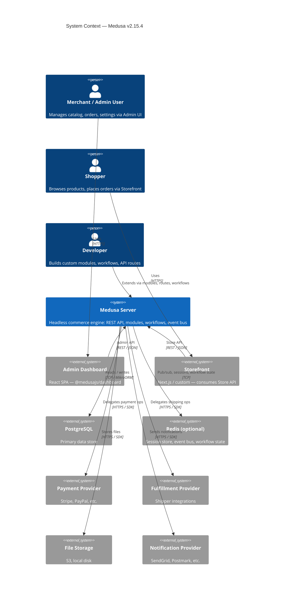
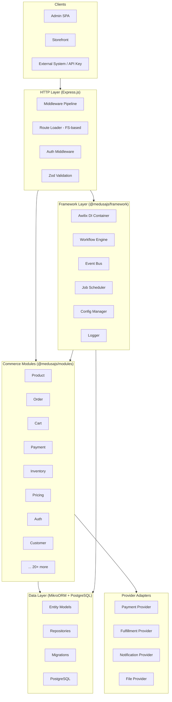
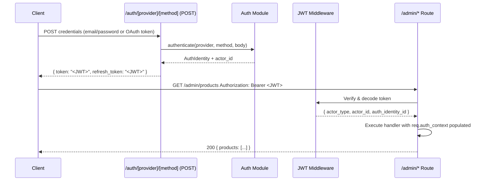

# Medusa v2.15.4 — Software Design Document (SDD)

**Version:** 2.15.4  
**Status:** Reference Architecture  
**Last Updated:** 2025

---

## 1. Document Purpose and Scope

This Software Design Document (SDD) describes the internal architecture, design decisions, and component interactions of **Medusa v2.15.4** — an open-source, headless commerce platform built on Node.js and TypeScript.

The document serves as a reference for:

- Engineers contributing to the Medusa core or building custom modules
- Solution architects designing commerce systems on top of Medusa
- Technical reviewers evaluating the platform's architectural fitness

**In scope:** The Medusa server runtime, its core framework packages, the module system, the workflow engine, the HTTP API layer, the database layer, and the DI container.

**Out of scope:** The React Admin dashboard (`packages/admin/dashboard`), the documentation website (`www/`), and third-party provider implementations beyond their interface contracts.

---

## 2. System Overview

### 2.1 System Purpose

Medusa is a **composable commerce engine**. Its primary purpose is to expose a set of commerce capabilities (product catalog, cart, orders, payments, inventory, pricing, promotions, fulfillment, customers, and more) as a set of independently deployable, independently testable modules, wired together by a thin framework layer that provides HTTP routing, dependency injection, a workflow engine, an event bus, and scheduled jobs.

The system is designed to be extended: developers can replace any built-in module with a custom one, add new API routes, compose multi-step business processes (workflows), and listen to domain events — all without forking the core.

### 2.2 System Boundary

Medusa runs as a **Node.js process** (the "Medusa server") that:

1. Connects to a **PostgreSQL** database (one schema per deployment; modules share it)
2. Optionally connects to **Redis** for session storage, the event bus, or the workflow engine's execution store
3. Serves a **REST API** over HTTP(S) consumed by Admin and Storefront clients
4. Emits **domain events** that trigger asynchronous subscribers
5. Executes **scheduled jobs** via a cron-style scheduler

External integrations (payment gateways, fulfilment providers, notification services, file storage providers, etc.) are abstracted behind provider interfaces and resolved via DI at runtime.

### 2.3 System Context Diagram



---

## 3. Design Goals and Constraints

### 3.1 Design Goals

| # | Goal | Rationale |
|---|------|-----------|
| G1 | **Modularity** | Each commerce domain (product, order, cart, …) is an isolated module with its own service, models, and migrations. Modules can be swapped out without touching the rest of the system. |
| G2 | **Composability** | Business logic is expressed as composable workflows (sagas) rather than deep call stacks. Hooks allow third-party injection at any workflow boundary. |
| G3 | **Extensibility** | New routes, subscribers, scheduled jobs, and modules are discovered by file-system convention; no manual registration is required. |
| G4 | **Testability** | The DI container and module isolation make unit and integration testing straightforward. Each module can be tested in isolation by providing a test container. |
| G5 | **Developer Experience** | TypeScript throughout, a rich type system for HTTP contracts (`HttpTypes`), and generated SDK types lower the barrier for API consumers. |
| G6 | **Operational Simplicity** | A single Node.js process, a single PostgreSQL database, and an optional Redis instance are all that is required to run Medusa. Horizontal scaling is achieved by running multiple stateless instances. |

### 3.2 Design Constraints

- **Runtime:** Node.js 20+ (LTS). Single-threaded event loop; CPU-bound work is expected to be minimal.
- **Database:** PostgreSQL only. MikroORM is the ORM; raw SQL is avoided in application code.
- **Language:** TypeScript 5.x. All packages target ES2021, module resolution Node16.
- **Package manager:** Yarn 3 (Berry) with `node-modules` linker; workspaces monorepo.
- **Build system:** Turborepo for inter-package dependency ordering.
- **No distributed transactions:** Cross-module consistency is achieved through the saga/compensation pattern in workflows, not two-phase commit.
- **Backward compatibility:** The public module service interfaces (`IProductModuleService`, etc.) are semver-stable. Internal implementation classes are not.

### 3.3 Assumptions

- A single PostgreSQL server/cluster is available at boot time.
- The application server has write access to the configured base directory (for file-system route and subscriber discovery).
- Redis is optional; the in-process event bus is the default. Production deployments are expected to use Redis.
- Admin authentication relies on short-lived JWTs. Refresh token rotation is the responsibility of the Admin client.

---

## 4. System Architecture

### 4.1 Architectural Style

Medusa v2 is a **modular monolith** with **event-driven** and **saga-based** extensions:

- **Modular monolith:** All modules run in the same process, share the same PostgreSQL database (different tables/schemas), and communicate via service interfaces resolved from the DI container — not over the network.
- **Event-driven extension points:** Modules emit domain events on the shared event bus. Subscribers react asynchronously. This decouples side effects (notifications, webhooks, analytics) from the core business logic.
- **Saga / workflow engine:** Multi-step business processes are expressed as compensatable workflows. If a step fails, the engine walks back through compensation handlers to restore consistency.

### 4.2 Layer Diagram



### 4.3 Component Decomposition

| Component | Package | Responsibility |
|-----------|---------|---------------|
| `@medusajs/framework` | `packages/core/framework` | DI container, HTTP loader, DB connection, workflow engine wiring, event bus, job scheduler, config |
| `@medusajs/core-flows` | `packages/core/core-flows` | Pre-built workflow definitions for all commerce domains |
| `@medusajs/workflows-sdk` | `packages/core/workflows-sdk` | `createStep` / `createWorkflow` API |
| `@medusajs/utils` | `packages/core/utils` | Shared utilities, `MedusaService` base class, decorators |
| `@medusajs/types` | `packages/core/types` | Shared TypeScript interfaces (`IProductModuleService`, `HttpTypes`, …) |
| `@medusajs/modules-sdk` | `packages/core/modules-sdk` | Module bootstrapping, joiner config |
| `@medusajs/medusa` | `packages/medusa` | Entry point, API route definitions, middleware configuration |
| `@medusajs/product` | `packages/modules/product` | Product catalog domain module |
| `@medusajs/order` | `packages/modules/order` | Order management domain module |
| *(and 20+ other modules)* | `packages/modules/*` | Commerce domain modules |

---

## 5. Module Architecture

### 5.1 Module Anatomy

Every commerce module follows the same internal structure:

```
packages/modules/<domain>/src/
├── index.ts                  # Module definition (service, loaders, joinerConfig)
├── joiner-config.ts          # Query-graph join configuration
├── models/                   # MikroORM entity models (via model.define())
│   ├── index.ts
│   └── product.ts
├── repositories/             # Custom query repositories (optional)
├── services/
│   ├── <domain>-module-service.ts   # Public IModuleService implementation
│   └── <entity>.ts                  # Internal MedusaInternalService per entity
├── migrations/               # MikroORM migration files
├── subscribers/              # (optional) intra-module event subscribers
└── types/                    # Module-private DTO types
```

The module's `index.ts` exports:

```typescript
export default Module(Modules.PRODUCT, {
  service: ProductModuleService,
})
```

This registers the module service under the module's key in the DI container, making it available to routes and workflows via `container.resolve(Modules.PRODUCT)`.

### 5.2 Module Interface (IModuleService Pattern)

Every module service implements a domain-specific interface declared in `@medusajs/framework/types`. The interface follows a CRUD-style contract:

```typescript
export interface IProductModuleService extends IModuleService {
  createProducts(data: CreateProductDTO[], context?: Context): Promise<ProductDTO[]>
  updateProducts(data: UpdateProductDTO[], context?: Context): Promise<ProductDTO[]>
  deleteProducts(ids: string[], context?: Context): Promise<void>
  retrieveProduct(id: string, config?: FindConfig<ProductDTO>, context?: Context): Promise<ProductDTO>
  listProducts(filters?: FilterableProductProps, config?: FindConfig<ProductDTO>, context?: Context): Promise<ProductDTO[]>
  listAndCountProducts(...): Promise<[ProductDTO[], number]>
  softDeleteProducts(ids: string[], context?: Context): Promise<void>
  restoreProducts(ids: string[], context?: Context): Promise<void>
  // ... similarly for Variants, Options, Categories, Collections, Tags, Types
}
```

The interface decouples consumers (routes, workflows) from the implementation. Swapping the implementation requires only replacing the `Module(...)` registration.

### 5.3 MedusaService Base Class

`MedusaService<TModels>` (from `@medusajs/framework/utils`) is the base class for all module services. It auto-generates `create*`, `update*`, `delete*`, `retrieve*`, `list*`, `listAndCount*`, `softDelete*`, and `restore*` methods for every registered model, wiring them to the underlying MikroORM repository.

```typescript
export class ProductModuleService
  extends MedusaService<{
    Product: { dto: ProductDTO }
    ProductVariant: { dto: ProductVariantDTO }
    // ...
  }>({ Product, ProductVariant, ... })
  implements IProductModuleService
{
  // Override or extend generated methods as needed
}
```

**Key decorators used on service methods:**

| Decorator | Purpose |
|-----------|---------|
| `@InjectManager()` | Injects a fresh EntityManager into the method's `sharedContext`. Used on public-facing methods. |
| `@InjectTransactionManager()` | Injects a transaction-scoped EntityManager. Used on protected internal methods. |
| `@MedusaContext()` | Marks a parameter as the shared context (injected by the decorator infrastructure). |
| `@EmitEvents()` | Collects domain events queued during the method and flushes them to the event bus after the transaction commits. |

### 5.4 Module Registration and Loading

At startup, `MedusaAppLoader` (in `packages/core/framework/src/medusa-app-loader.ts`) orchestrates:

1. **Configuration loading** — reads `medusa-config.ts` from the project root via `ConfigManager`.
2. **Module resolution** — each enabled module is instantiated with its configured options and registered in the Awilix container under its key (e.g., `Modules.PRODUCT`).
3. **Database migration** — pending MikroORM migrations for each module are run against the shared PostgreSQL database.
4. **HTTP route loading** — `RoutesLoader` scans `src/api/**` for `route.ts` files and registers Express handlers.
5. **Subscriber loading** — `SubscriberLoader` scans `src/subscribers/**` for subscriber files and attaches them to the event bus.
6. **Job loading** — `JobLoader` scans `src/jobs/**` for cron job files and registers them with the scheduler.
7. **Workflow loading** — `WorkflowLoader` registers workflow definitions with the distributed execution engine.

### 5.5 Module Links

Because each module owns its own tables, cross-module relationships (e.g., a `Cart` referencing a `Product Variant`) are expressed as **Module Links** rather than foreign keys.

A link is defined in `src/links/` (in the main `@medusajs/medusa` package) using `defineLink`:

```typescript
import ProductModule from "@medusajs/product"
import CartModule from "@medusajs/cart"

export default defineLink(
  CartModule.linkable.lineItem,
  ProductModule.linkable.productVariant
)
```

At runtime, links are stored in a dedicated pivot table managed by the **Remote Link** service. The **Query** utility (`ContainerRegistrationKeys.QUERY`) can traverse these links transparently:

```typescript
const { data } = await query.graph({
  entity: "cart",
  fields: ["id", "line_items.product_variant.*"],
})
```

This pattern preserves module isolation while enabling rich cross-module data retrieval without coupling module databases.

---

## 6. Framework Design

### 6.1 DI Container (Awilix)

Medusa uses **Awilix** as its IoC container. The container is created once per process startup and exposed via `packages/core/framework/src/container.ts`.

**Registration scopes:**

| Scope | Usage |
|-------|-------|
| `SINGLETON` | Module services, config, logger, event bus, pg connection |
| `SCOPED` (request) | Per-request resources created in `req.scope` — isolates request context |
| `TRANSIENT` | Rare; used for short-lived utilities |

Each incoming HTTP request gets a **child scope** (`req.scope`) created from the root container. This child scope holds request-specific registrations (e.g., the authenticated actor's identity) and is garbage-collected when the request ends, preventing cross-request state leakage.

Module services resolve their dependencies through the constructor:

```typescript
constructor({
  productRepository,
  productVariantService,
  [Modules.EVENT_BUS]: eventBusModuleService,
}: InjectedDependencies) {
  super(...)
  this.productRepository_ = productRepository
  this.eventBusModuleService_ = eventBusModuleService
}
```

Awilix resolves the `InjectedDependencies` object by matching keys to registered names in the container, using **name-based injection** (not type-based).

### 6.2 HTTP Layer (Express.js Route Loading)

The HTTP layer is built on **Express.js** and is initialized in `expressLoader`.

**Startup sequence:**

1. Attach global middleware: `cookieParser`, `express-session` (backed by Redis or DynamoDB if configured), `morgan` (request logging), CORS headers, body parsers.
2. `RoutesLoader.load(sourceDir)` — walks the `src/api` directory tree, discovers every file named `route.ts` (or `route.js`), and derives the Express path from the directory structure:
   - Directory `[id]` becomes `:id`
   - e.g., `src/api/admin/products/[id]/route.ts` → `/admin/products/:id`
3. For each discovered route file, named exports matching HTTP verbs (`GET`, `POST`, `PUT`, `PATCH`, `DELETE`) are registered as Express handlers.
4. The `AUTHENTICATE` export flag (boolean) controls whether the route is wrapped with the JWT/API-key authentication middleware.
5. The `CORS` export flag controls per-route CORS policy override.

**Request lifecycle:**

```
Incoming Request
  → Global Middleware (CORS, body-parser, cookie-parser, session)
  → Auth Middleware (JWT decode / API key lookup → populate req.auth_context)
  → Route Handler
      → Zod validation (req.body, req.query, req.params)
      → Business logic via workflow or module service
      → JSON response
```

### 6.3 Database Layer (MikroORM, PostgreSQL)

**ORM:** MikroORM 6.x with the PostgreSQL driver.

**Connection:** A single shared `knex` / `pg` connection pool is initialised by `pgConnectionLoader` and registered in the container under `ContainerRegistrationKeys.PG_CONNECTION`. Each module's MikroORM `EntityManager` is created on top of this shared pool.

**Connection pool defaults (configurable via `databaseDriverOptions.pool`):**

| Parameter | Default |
|-----------|---------|
| `min` | 2 |
| `max` | 10 (driver default) |
| `idleTimeoutMillis` | driver default |

**Entity definition:** Models are defined using the `model` DSL from `@medusajs/framework/utils`:

```typescript
const Product = model.define("Product", {
  id: model.id({ prefix: "prod" }).primaryKey(),
  title: model.text().searchable().translatable(),
  status: model.enum(ProductStatus).default(ProductStatus.DRAFT),
  variants: model.hasMany(() => ProductVariant, { mappedBy: "product" }),
  deleted_at: model.dateTime().nullable(), // soft delete
})
```

**Conventions:**

- **Primary keys:** Prefixed NanoIDs (e.g., `prod_01J...`), generated by `generateEntityId`.
- **Naming:** TypeScript model classes are PascalCase; database columns are snake_case (MikroORM naming strategy).
- **Soft deletes:** Most entities have a `deleted_at` column. `softDelete` / `restore` are generated on `MedusaService`.
- **Timestamps:** `created_at` and `updated_at` are managed by MikroORM lifecycle hooks.
- **Migrations:** Each module owns its migrations in `src/migrations/`. MikroORM CLI (`mikro-orm-cli`) generates them from model diffs.

### 6.4 Workflow Engine

The workflow engine is the **orchestration backbone** of Medusa's business logic layer. It is implemented in `@medusajs/orchestration` and exposed to application code through the `@medusajs/framework/workflows-sdk` facade.

**Core concepts:**

| Concept | Description |
|---------|-------------|
| **Step** | A discrete, potentially async unit of work with a main function and an optional compensation function. Created with `createStep(id, handler, compensationHandler?)`. |
| **Workflow** | A DAG of steps composed using `createWorkflow(id, composerFn)`. The composer function is **not** executed directly; it is interpreted by the engine to build an execution plan. |
| **StepResponse** | Returned by the main handler: `new StepResponse(result, compensationInput)`. The `compensationInput` is stored and passed to the compensation function if rollback is needed. |
| **WorkflowResponse** | Returned by the workflow composer: `new WorkflowResponse(output, { hooks })`. |
| **Hook** | An extension point declared with `createHook(name, data)`. Third-party code can register step handlers for hooks without modifying the workflow. |

**Execution modes:**

- **In-process:** The default. Steps run sequentially in the Node.js event loop. The execution context is stored in memory or in Redis (if `redisUrl` is configured) for durability.
- **Distributed (Redis):** When a Redis URL is configured, workflow state is persisted between steps, enabling long-running workflows that survive process restarts.

**`transform` and `when`:** These utilities allow data reshaping and conditional step execution within the composer function without breaking the declarative execution model.

### 6.5 Event Bus

The event bus decouples side effects from business logic. Modules emit events; subscribers react asynchronously.

**Implementations:**

| Module | Backing | Use case |
|--------|---------|---------|
| `@medusajs/event-bus-local` | In-process, EventEmitter | Development / single-instance deployments |
| `@medusajs/event-bus-redis` | Redis Streams / BullMQ | Production multi-instance deployments |

**Emitting events:**

Within a module service, the `@EmitEvents()` decorator collects events queued via `MessageAggregator` during a transaction and flushes them to the event bus after the transaction commits — guaranteeing that events are only published when the data they describe has been persisted.

```typescript
// Inside a service method:
this.eventBusModuleService_?.emit([{
  eventName: ProductEvents.PRODUCT_CREATED,
  data: { id: product.id },
}])
```

**Subscribing to events:**

Subscribers are discovered by file convention (`src/subscribers/*.ts`). Each file exports a `handler` async function and a `config` object:

```typescript
export const config: SubscriberConfig = {
  event: ProductEvents.PRODUCT_CREATED,
}

export default async function handler({ data, container }: SubscriberArgs) {
  // react to product.created
}
```

### 6.6 Job Scheduler

Scheduled jobs are cron-style tasks registered by file convention (`src/jobs/*.ts`). Each file exports a default handler and a `config`:

```typescript
export const config: CronJobConfig = {
  name: "sync-inventory",
  schedule: "0 * * * *", // every hour
}

export default async function (container: MedusaContainer) {
  const inventoryService = container.resolve(Modules.INVENTORY)
  // ...
}
```

Internally, `JobLoader` wraps each job handler in a `createWorkflow` + `createStep` pair so that jobs benefit from the same error handling and retry semantics as workflows. The scheduler backend is pluggable (default: in-process; Redis-backed for production).

---

## 7. Data Design

### 7.1 Data Partitioning by Module

Each module owns a logical partition of the database. There is no physical schema-per-module (all tables share the `public` schema by default), but ownership is enforced by convention: only a module's own service may write to its tables. Other modules reference cross-module entities via **Module Links** (pivot tables), not direct foreign keys.

| Module | Key tables |
|--------|-----------|
| Product | `product`, `product_variant`, `product_option`, `product_category`, `product_collection`, `product_tag`, `product_type`, `product_image` |
| Order | `order`, `order_item`, `order_address`, `order_shipping_method`, `order_transaction`, `return`, `exchange`, `claim` |
| Cart | `cart`, `line_item`, `address`, `shipping_method` |
| Customer | `customer`, `customer_address`, `customer_group` |
| Pricing | `price_set`, `price`, `price_rule`, `price_list` |
| Inventory | `inventory_item`, `inventory_level`, `reservation_item` |
| Payment | `payment_collection`, `payment_session`, `payment`, `refund` |
| Auth | `auth_identity`, `provider_identity` |
| API Key | `api_key` |

### 7.2 Database Schema Conventions

- **Column names:** `snake_case` (MikroORM naming strategy converts PascalCase properties automatically).
- **Primary keys:** `VARCHAR` prefixed NanoIDs (`prod_01J...`, `order_01J...`). Prefix is defined per entity.
- **Soft deletes:** `deleted_at TIMESTAMPTZ NULL`. A non-null value means the record is deleted. MikroORM global filters exclude soft-deleted rows from all standard queries.
- **Timestamps:** `created_at` and `updated_at` — managed by MikroORM `@BeforeCreate` / `@BeforeUpdate` hooks.
- **Enums:** Stored as `VARCHAR`, not Postgres `ENUM` types, to avoid migration friction.
- **JSON columns:** Used sparingly for `metadata` fields and provider-specific data blobs.
- **Indexes:** Added on foreign-key columns and commonly filtered columns (e.g., `status`, `handle`).

### 7.3 Module Links (Cross-Module Relationships)

Module Links are the mechanism for expressing relationships between entities owned by different modules. A link definition produces a managed pivot table:

```
cart_line_item_product_variant  (link: Cart ↔ Product)
  ├── cart_line_item_id   VARCHAR  FK→ line_item.id (cascade)
  └── product_variant_id  VARCHAR  (no FK — cross-module reference)
```

The `product_variant_id` side deliberately has **no database foreign key** into the Product module's table. Referential integrity is maintained at the application layer by the Remote Link service.

The **Query** utility resolves links at read time by joining through the pivot table, so consumers get a unified graph without awareness of the underlying pivot structure.

### 7.4 Shared Context (MedusaContext)

The `Context` object (aliased `MedusaContext` in decorator usage) threads a shared `EntityManager` and transaction through an entire call stack, ensuring all operations within a unit of work share the same database transaction:

```typescript
interface Context {
  manager?: EntityManager          // Shared MikroORM EntityManager
  transactionManager?: EntityManager
  isolationLevel?: string
  enableNestedTransactions?: boolean
  eventGroupId?: string            // Groups events emitted in this context
  messageAggregator?: MessageAggregator
  requestId?: string
  idempotencyKey?: string
}
```

When a workflow step calls a module service, it passes this context down via the `@MedusaContext()` decorated parameter. The `@InjectManager` / `@InjectTransactionManager` decorators on the service method ensure the correct EntityManager is injected into the context before execution.

---

## 8. Interface Design

### 8.1 REST API Design

The Medusa API is a conventional JSON REST API. Key design decisions:

- **Versioned prefix:** All API routes are prefixed with `/admin`, `/store`, or `/auth` (no explicit version segment; breaking changes are managed through the module versioning system).
- **JSON bodies:** `Content-Type: application/json` for all mutation endpoints.
- **Pagination:** Cursor-style or offset-based via `limit` / `offset` query parameters. Responses include a `count` field.
- **Field selection:** `fields` query parameter allows sparse fieldsets (e.g., `?fields=id,title,variants.id`). Resolved by the Query utility.
- **Filtering:** Standardised `filterableFields` extracted from the request by framework middleware.
- **Validation:** Zod schemas defined per-route validate `req.body`, `req.query`, and `req.params`. A validation failure yields `400 Bad Request` with a structured error body.

### 8.2 Admin API Routes

Admin routes live under `packages/medusa/src/api/admin/`. They require a valid JWT token (bearer token in the `Authorization` header) obtained from the `/auth` endpoints.

Route structure mirrors the module decomposition:

```
/admin/products              GET (list), POST (create)
/admin/products/:id          GET, POST (update), DELETE
/admin/products/:id/variants GET, POST
/admin/orders                GET (list)
/admin/orders/:id            GET
/admin/orders/:id/fulfillments POST
...
```

Most admin route handlers delegate immediately to a pre-built workflow:

```typescript
export const POST = async (req: AuthenticatedMedusaRequest, res: MedusaResponse) => {
  const { result } = await createProductWorkflow(req.scope).run({
    input: req.body,
  })
  res.status(200).json({ product: result })
}
```

### 8.3 Store API Routes

Store routes live under `packages/medusa/src/api/store/`. They accept an **optional** bearer token for authenticated customer sessions, but most listing endpoints are unauthenticated.

The Store API surface is intentionally narrower than the Admin API — it exposes only what a shopper needs: product browsing, cart management, checkout, and order lookup.

Store routes enforce a **publishable API key** header (`x-publishable-api-key`) to scope the response to a specific sales channel.

### 8.4 Authentication Flow



**Token types:**

| Type | Usage | Lifetime |
|------|-------|---------|
| JWT (access) | Admin / Store session | Short-lived (configurable; default 24h) |
| JWT (refresh) | Obtain new access token | Longer-lived |
| API Key | Programmatic / machine access | Does not expire (unless manually revoked) |
| Publishable API Key | Store frontend identification | Does not expire |

---

## 9. Component Design

### 9.1 Workflow Step Pattern (createStep)

A **step** is the atomic unit of a workflow. It encapsulates a single side-effectful operation and its inverse (compensation).

```typescript
export const createProductsStep = createStep(
  "create-products",                           // Unique step ID
  async (data: CreateProductDTO[], { container }) => {
    const productModule = container.resolve<IProductModuleService>(Modules.PRODUCT)
    const created = await productModule.createProducts(data)
    return new StepResponse(
      created,                                 // Result passed to next step
      created.map((p) => p.id)                 // Compensation data (stored by engine)
    )
  },
  async (createdIds, { container }) => {       // Compensation handler
    if (!createdIds?.length) return
    const productModule = container.resolve<IProductModuleService>(Modules.PRODUCT)
    await productModule.deleteProducts(createdIds)
  }
)
```

**Step contract rules:**

1. The main handler must return a `StepResponse`.
2. The compensation data (second argument to `StepResponse`) must be JSON-serialisable (it is persisted).
3. Compensation handlers must be idempotent.
4. Steps must not hold references to non-serialisable closures.

### 9.2 Workflow Composition (createWorkflow)

A **workflow** is a named, composable sequence of steps. The composer function is a **pure, synchronous** function evaluated at definition time (not execution time) to build the execution graph.

```typescript
export const createProductWorkflow = createWorkflow(
  "create-product",
  (input: WorkflowData<CreateProductInput>) => {
    // Steps are called declaratively — return values are "future" references
    const products = createProductsStep(input.products)

    const priceSets = createPriceSetsStep(
      transform({ products }, ({ products }) =>
        products.map((p) => ({ /* price set input */ }))
      )
    )

    // Hooks are extension points for third-party step injection
    const productsCreated = createHook("productsCreated", { products })

    return new WorkflowResponse(products, { hooks: [productsCreated] })
  }
)
```

**`transform()`** is used for data reshaping between steps without introducing imperative code into the composer. It evaluates lazily at runtime.

**`when(condition, fn)`** enables conditional step execution (similar to an if-branch in the execution graph).

**`parallelize(...steps)`** executes multiple independent steps concurrently.

### 9.3 Compensation (Saga Pattern)

Medusa implements the **Saga choreography / orchestration hybrid** pattern for distributed consistency:

1. Each step's compensation handler is registered when `createStep` is called.
2. During execution, the engine tracks which steps have completed and stores their compensation data.
3. If any step throws, the engine triggers compensation in **reverse order** (last completed step first).
4. Compensation continues until all completed steps have been rolled back.

This provides **eventual consistency** without distributed transactions. The pattern is suitable for Medusa's architecture because cross-module writes are uncommon within a single workflow step (each step typically writes to one module's tables within a single transaction).

### 9.4 Provider Pattern

Medusa uses **provider modules** to abstract integrations with external services. A provider module implements a standard interface (e.g., `IPaymentProvider`, `IFulfillmentProvider`, `INotificationProvider`) and is registered in `medusa-config.ts` under the parent module's `providers` array.

```typescript
// medusa-config.ts
module.exports = defineConfig({
  modules: [
    {
      resolve: "@medusajs/payment",
      options: {
        providers: [
          { resolve: "@medusajs/payment-stripe", options: { apiKey: "..." } },
        ],
      },
    },
  ],
})
```

The parent module resolves the provider from the container and delegates the provider-specific operation to it. This keeps the core module logic provider-agnostic.

---

## 10. Security Design

### 10.1 Authentication (JWT, API Keys)

**JWT authentication** is used for human actors (admin users, customers). Tokens are issued by the `/auth` endpoint after the Auth Module validates credentials via the configured provider (email/password, OAuth, etc.). The JWT payload contains:

```json
{
  "actor_type": "user",
  "actor_id": "user_01J...",
  "auth_identity_id": "authid_01J...",
  "iat": 1700000000,
  "exp": 1700086400
}
```

The JWT secret is configured via `projectConfig.http.jwtSecret`.

**API Key authentication** is used for machine-to-machine access. API keys are stored in the `api_key` table (hashed) and looked up on every request. The `ApiKeyModule` validates the key and returns the associated actor context.

**Session-based authentication** is available as a legacy option for Admin clients that prefer cookie-based sessions (backed by Redis or DynamoDB).

### 10.2 Authorization (RBAC)

Medusa v2 implements **Role-Based Access Control** via the `@medusajs/rbac` module. Admin users are assigned roles; roles are granted permissions; permissions are scoped to resource/action pairs (e.g., `product:create`, `order:read`).

The authorization check is applied in route middleware after authentication. Routes opt in to RBAC enforcement via the route file's `AUTHENTICATE` export and the middleware configuration in `middlewares.ts`.

### 10.3 Input Validation (Zod)

All mutation endpoints validate their request body, query parameters, and path parameters using **Zod schemas** defined in `validators.ts` files co-located with the route. The framework's validation middleware calls the schema's `.parse()` method; a `ZodError` is caught and transformed into a `400 Bad Request` response with a structured error payload listing each validation failure.

Example:

```typescript
// admin/products/validators.ts
export const AdminCreateProduct = z.object({
  title: z.string().min(1),
  status: z.nativeEnum(ProductStatus).optional().default(ProductStatus.DRAFT),
  variants: z.array(AdminCreateProductVariant).optional(),
})
```

---

## 11. Error Handling Design

### 11.1 MedusaError Types

All application-layer errors are expressed as `MedusaError` instances:

```typescript
throw new MedusaError(MedusaError.Types.NOT_FOUND, `Product with id: ${id} was not found`)
```

| Error Type | Semantic | Typical HTTP Status |
|-----------|---------|-------------------|
| `NOT_FOUND` | Resource does not exist | 404 |
| `INVALID_DATA` | Malformed input or failed business rule | 400 |
| `NOT_ALLOWED` | Operation is not permitted in current state | 400 / 403 |
| `CONFLICT` | Unique constraint / concurrent modification | 409 |
| `UNEXPECTED_STATE` | Internal inconsistency; indicates a bug | 500 |
| `UNAUTHORIZED` | Missing or invalid credentials | 401 |
| `PAYMENT_AUTHORIZATION_ERROR` | Payment-specific authorization failure | 402 |

`MedusaError` extends `Error` and carries a `type` string that the HTTP error handler uses to select the appropriate HTTP status code.

### 11.2 HTTP Error Mapping

The global Express error handler (registered last in `expressLoader`) catches all errors and transforms them into a consistent JSON response:

```json
{
  "type": "not_found",
  "message": "Product with id: prod_01J was not found"
}
```

**Mapping logic:**

```
MedusaError.Types.NOT_FOUND        → 404
MedusaError.Types.UNAUTHORIZED     → 401
MedusaError.Types.NOT_ALLOWED      → 403
MedusaError.Types.CONFLICT         → 409
MedusaError.Types.INVALID_DATA     → 400
MedusaError.Types.UNEXPECTED_STATE → 500
ZodError                           → 400 (with field-level details)
Unhandled Error                    → 500 (message suppressed in production)
```

In production mode, unhandled error messages are replaced with a generic `"An unknown error occurred"` to prevent information leakage.

---

## 12. Performance Design

### 12.1 Caching Strategy

Medusa v2 does not implement an application-level cache by default. Performance-sensitive deployments are expected to apply caching at one or more of the following layers:

| Layer | Strategy |
|-------|---------|
| **CDN / Edge** | Cache Store API GET responses (product listings, product detail) at the CDN edge. Cache-Control headers are set by Storefront convention. |
| **Read replicas** | Route read-heavy queries to a PostgreSQL read replica via `databaseUrl` pointing to a replica or a PgBouncer pool. |
| **In-memory (custom)** | Developers can inject a cache module (e.g., `@medusajs/cache-redis`) and wrap service methods with cache-aside logic in custom modules. |
| **HTTP response caching** | Not built-in; can be added via Express middleware (e.g., `cache-control` headers + a reverse proxy like Nginx or Varnish). |

The `Query` utility's field-selection feature reduces over-fetching by issuing targeted SQL `SELECT` statements (only the requested fields are fetched), which improves both query performance and serialisation throughput.

### 12.2 Connection Pooling

Database connections are pooled through **`pg` (node-postgres)** managed by `knex`, which is initialized by `pgConnectionLoader`. MikroORM EntityManagers are created on top of this shared connection pool rather than opening new connections per request.

**Configuration (via `databaseDriverOptions.pool` in `medusa-config.ts`):**

```typescript
databaseDriverOptions: {
  pool: {
    min: 2,
    max: 20,               // Tune to (CPU cores × 2) + effective_spindle_count
    idleTimeoutMillis: 30000,
  }
}
```

For high-concurrency deployments, **PgBouncer** in transaction-mode pooling is recommended in front of PostgreSQL to multiplex application connections.

### 12.3 Background Jobs

CPU-bound or slow I/O operations (e.g., syncing inventory, generating reports, sending bulk notifications) should be implemented as **scheduled jobs** (file convention: `src/jobs/*.ts`) or as **asynchronous event subscribers** (`src/subscribers/*.ts`), keeping the HTTP request handlers fast and non-blocking.

For high-throughput job processing, the Redis-backed event bus (`@medusajs/event-bus-redis`) provides durable queuing with BullMQ, enabling:

- **Job retries** with exponential back-off on handler failure
- **Concurrency control** (configurable workers per queue)
- **Job deduplication** via `idempotencyKey`
- **Dead-letter queues** for poison messages

Long-running workflows (e.g., multi-day return processing) benefit from the **distributed workflow engine** backed by Redis, which persists execution state between steps and survives process restarts.

---

*End of Software Design Document — Medusa v2.15.4*
