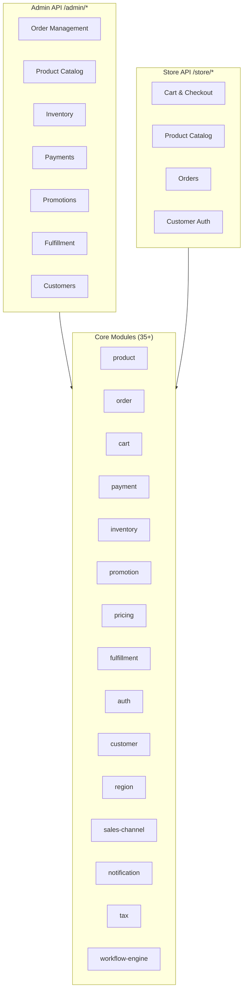
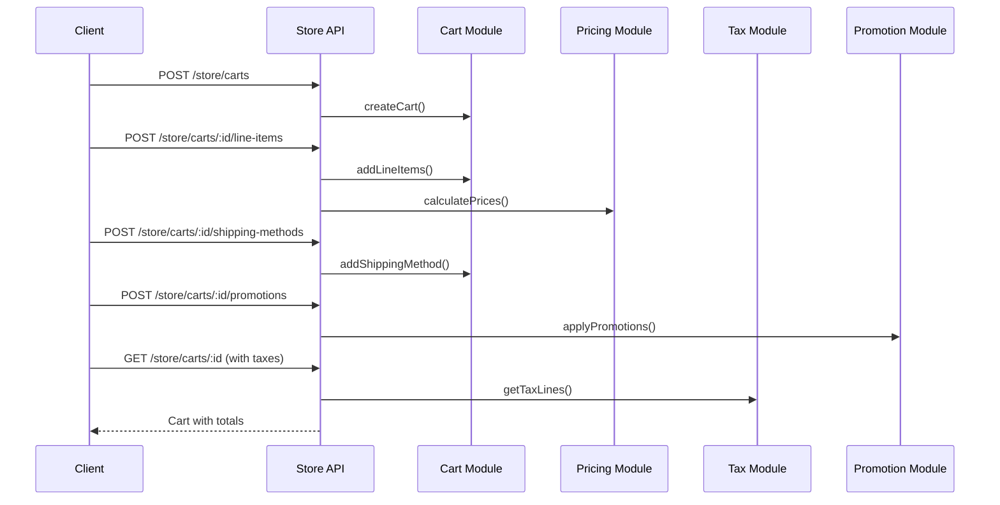
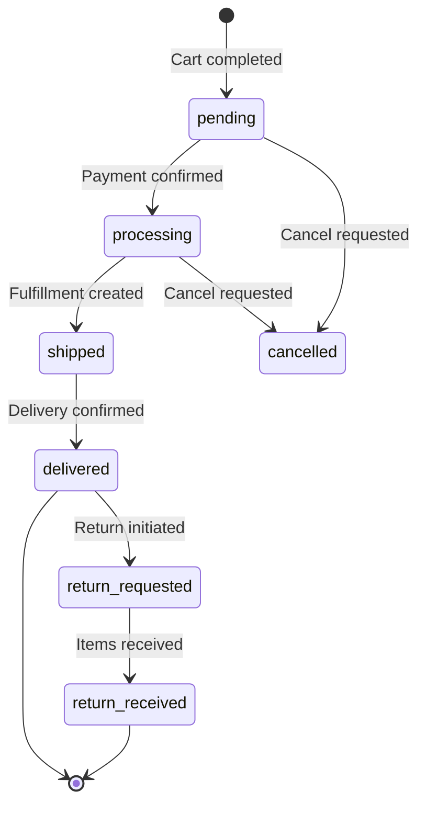
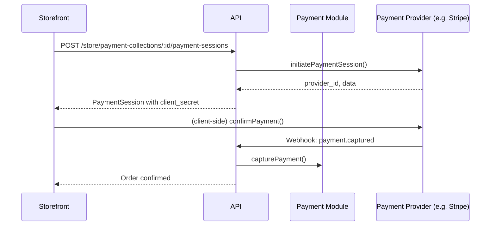
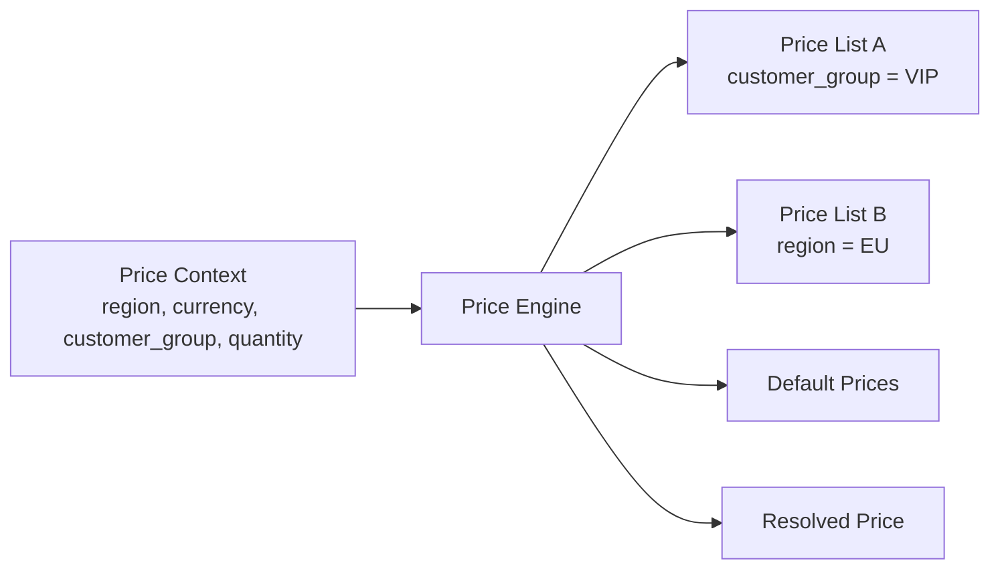
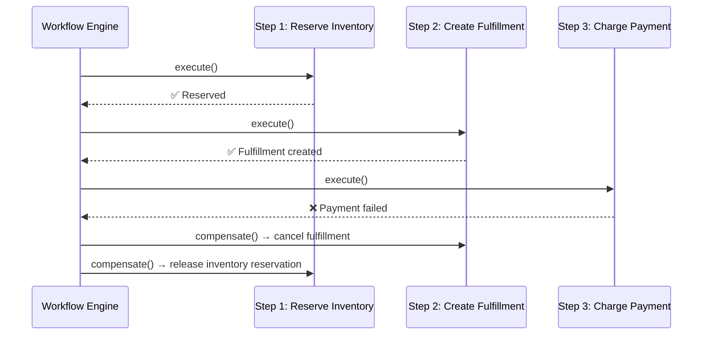
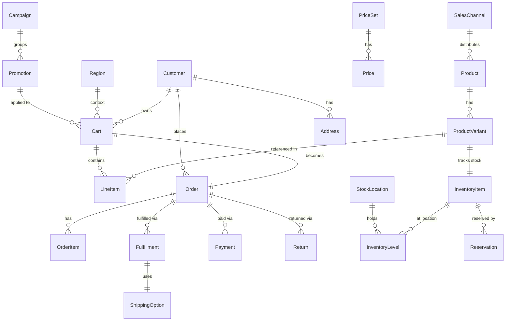
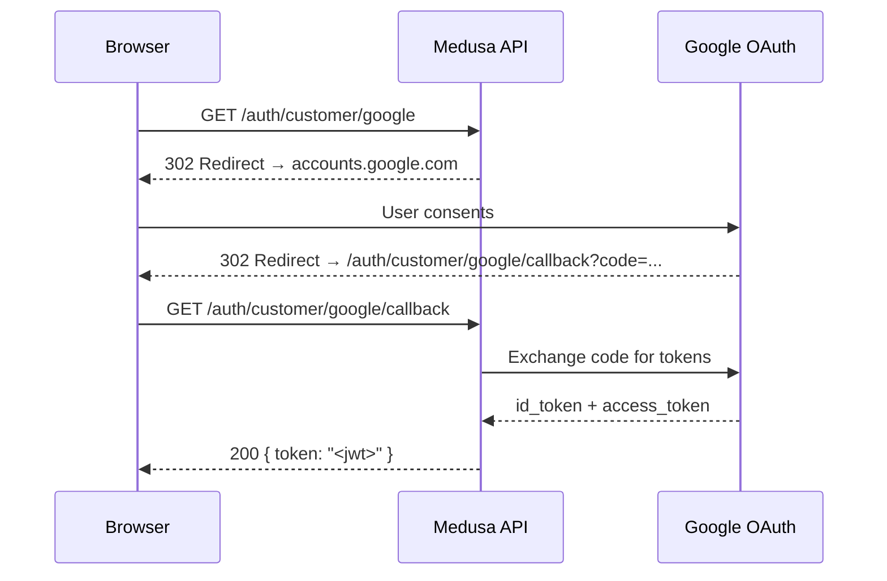

# Medusa v2.15.4 — SpecKit / Functional & Technical Specification

> **Version**: 2.15.4  
> **Document type**: Functional & Technical Specification (SpecKit)  
> **Audience**: Product managers, architects, backend developers, integration engineers

---

## 1. Product Overview

### 1.1 Vision

Medusa is an open-source, headless commerce platform built for developers who need total control over their commerce stack. It replaces rigid, monolithic SaaS platforms with a composable, module-driven architecture where every commerce capability is an independently deployable TypeScript package.

The platform is designed around a single guiding principle: **every team should own their commerce infrastructure**. Whether operating a B2C storefront, a B2B marketplace, a subscription service, or a multi-region retail operation, Medusa provides the primitives to build exactly the right system—without vendor lock-in.

### 1.2 Target Users

| Persona | Description | Primary Needs |
|---|---|---|
| **Merchant** | Business operating an online store or multi-channel commerce operation | Order management, inventory tracking, promotions, customer service tooling |
| **Developer** | Engineer building and maintaining the commerce platform | Extensible APIs, type-safe SDKs, clear module boundaries, workflow composition |
| **System Integrator** | Agency or consultant deploying Medusa for clients | Plugin ecosystem, provider abstractions, configuration flexibility |
| **Platform Engineer** | DevOps/infrastructure engineer running Medusa in production | Horizontal scaling, worker separation, observability hooks |

### 1.3 Core Value Propositions

1. **Composable modules** — 35+ independently configurable commerce modules with clear domain boundaries.  
2. **Workflow engine** — First-class saga/compensation support via `createWorkflow`/`createStep` for reliable multi-step operations.  
3. **Provider abstraction** — Swap payment, fulfillment, auth, file, notification, and caching providers without changing business logic.  
4. **Type-safe extensibility** — Full TypeScript throughout; custom modules, routes, workflows, and subscribers follow typed contracts.  
5. **Headless by design** — Admin API (`/admin/*`) and Store API (`/store/*`) are fully decoupled from any frontend; any client can integrate.  
6. **Multi-channel & multi-region** — Sales channels, regions, currencies, and price lists are first-class citizens.

---

## 2. Functional Specifications

### 2.1 Commerce Capabilities Overview



### 2.2 Product Catalog

#### Feature: List/Search Products, Variants, Options, Collections, Categories

Medusa provides a full product information management surface through the `product` module.

| Entity | Description | Key Fields |
|---|---|---|
| **Product** | Top-level product record | `id`, `title`, `handle`, `status`, `collection_id`, `type_id`, `tags`, `sales_channels` |
| **ProductVariant** | Specific sellable SKU | `id`, `product_id`, `sku`, `barcode`, `prices`, `options` |
| **ProductOption** | Dimension of variation (e.g., Size) | `id`, `product_id`, `title`, `values` |
| **ProductCollection** | Editorial grouping of products | `id`, `title`, `handle` |
| **ProductCategory** | Hierarchical taxonomy node | `id`, `name`, `handle`, `parent_category_id`, `rank` |
| **ProductTag** | Flat label for filtering | `id`, `value` |
| **ProductType** | Classification type | `id`, `value` |

**Admin API endpoints:**

| Method | Path | Description |
|---|---|---|
| `GET` | `/admin/products` | List products with filtering, pagination, fields selection |
| `POST` | `/admin/products` | Create a product with variants and options |
| `GET` | `/admin/products/:id` | Get product detail |
| `POST` | `/admin/products/:id` | Update product |
| `DELETE` | `/admin/products/:id` | Delete product |
| `GET` | `/admin/products/:id/variants` | List variants for a product |
| `POST` | `/admin/products/:id/variants` | Add variant to product |
| `GET` | `/admin/collections` | List collections |
| `POST` | `/admin/collections` | Create collection |
| `GET` | `/admin/product-categories` | List categories (tree-aware) |
| `POST` | `/admin/product-categories` | Create category |
| `GET` | `/admin/product-tags` | List tags |
| `GET` | `/admin/product-types` | List types |

#### Feature: Product Import/Export

Products can be bulk-imported via CSV through the `/admin/products/import` endpoint. The import workflow parses CSV rows, validates them, creates batch operations, and dispatches async processing. Export is available via `/admin/products/export`, which returns a file download URL for the generated CSV backed by the configured file provider.

### 2.3 Cart and Checkout

#### Feature: Cart CRUD, Line Items, Shipping, Promotions, Taxes

The cart module manages the pre-order state. It is the central aggregation point for products, pricing, promotions, shipping, and tax calculations.



| Method | Path | Description |
|---|---|---|
| `POST` | `/store/carts` | Create cart |
| `GET` | `/store/carts/:id` | Get cart with computed totals |
| `POST` | `/store/carts/:id` | Update cart (region, customer, address) |
| `POST` | `/store/carts/:id/line-items` | Add line item |
| `POST` | `/store/carts/:id/line-items/:line_id` | Update line item quantity |
| `DELETE` | `/store/carts/:id/line-items/:line_id` | Remove line item |
| `POST` | `/store/carts/:id/shipping-methods` | Set shipping method |
| `POST` | `/store/carts/:id/promotions` | Apply promotion code |
| `DELETE` | `/store/carts/:id/promotions/:code` | Remove promotion |
| `POST` | `/store/carts/:id/payment-collection` | Initialize payment collection |
| `POST` | `/store/carts/:id/complete` | Complete cart → creates order |

### 2.4 Order Management

#### Feature: Order Lifecycle



**Admin order endpoints:**

| Method | Path | Description |
|---|---|---|
| `GET` | `/admin/orders` | List orders with rich filtering |
| `GET` | `/admin/orders/:id` | Order detail with items, fulfillments, payments |
| `POST` | `/admin/orders/:id` | Update order metadata |
| `POST` | `/admin/orders/:id/fulfillments` | Create fulfillment |
| `POST` | `/admin/orders/:id/fulfillments/:fid/shipments` | Mark items shipped |
| `POST` | `/admin/orders/:id/cancel` | Cancel order |
| `POST` | `/admin/orders/:id/archive` | Archive order |

#### Feature: Returns, Exchanges, Claims

Medusa models post-order flows as first-class entities:

- **Return** — customer sends back items; triggers refund workflow on completion  
- **Exchange** — return + new outbound shipment in a single transaction  
- **Claim** — damaged/wrong item report; can trigger replacement or refund  
- **Order Edit** — merchant-initiated line item changes with customer confirmation step  
- **Draft Order** — admin-created order bypassing the storefront checkout flow  

| Method | Path | Description |
|---|---|---|
| `POST` | `/admin/orders/:id/returns` | Initiate return |
| `POST` | `/admin/returns/:id/receive` | Mark return received |
| `POST` | `/admin/orders/:id/exchanges` | Create exchange |
| `POST` | `/admin/orders/:id/claims` | Create claim |
| `POST` | `/admin/order-edits` | Create order edit |
| `POST` | `/admin/order-edits/:id/confirm` | Confirm order edit |
| `POST` | `/admin/draft-orders` | Create draft order |

### 2.5 Payment Processing

#### Feature: Payment Collections, Sessions, Capture, Refund

Payments in Medusa follow a three-step model: **collection → session → capture**.



**Provider abstraction** — Every payment provider implements `IPaymentProvider`:
- `initiatePaymentSession()`
- `capturePayment()`
- `refundPayment()`
- `cancelPayment()`
- `retrievePayment()`
- `getPaymentStatus()`

Bundled providers: `@medusajs/payment-stripe`, `@medusajs/payment-paypal`

| Method | Path | Description |
|---|---|---|
| `POST` | `/admin/payment-collections` | Create payment collection |
| `POST` | `/admin/payment-collections/:id/payment-sessions` | Initialize provider session |
| `POST` | `/admin/payments/:id/capture` | Capture authorized payment |
| `POST` | `/admin/payments/:id/refund` | Issue refund |
| `GET` | `/store/payment-collections/:id` | Get payment collection state |

### 2.6 Customer Management

#### Feature: Customer Accounts, Groups, Addresses

| Method | Path | Description |
|---|---|---|
| `GET` | `/admin/customers` | List customers |
| `POST` | `/admin/customers` | Create customer |
| `GET` | `/admin/customers/:id` | Customer detail |
| `POST` | `/admin/customers/:id` | Update customer |
| `DELETE` | `/admin/customers/:id` | Delete customer |
| `POST` | `/admin/customers/:id/addresses` | Add address |
| `GET` | `/admin/customer-groups` | List groups |
| `POST` | `/admin/customer-groups` | Create group |
| `POST` | `/admin/customer-groups/:id/customers` | Add customers to group |

Store API mirrors customer self-service: `GET/POST /store/customers/me`, `/store/customers/me/addresses`.

### 2.7 Pricing Engine

#### Feature: Price Lists, Money Amounts, Currency Support

The pricing module implements a rule-based price resolution engine. A price for a variant is determined by evaluating all applicable price lists against a context (customer group, region, currency, quantity).



**Entities:**

| Entity | Description |
|---|---|
| `PriceSet` | Container linking a resource (variant) to multiple prices |
| `Price` | A specific money amount with optional rule conditions |
| `PriceList` | A named set of overrides with activation rules |
| `PriceRule` | Condition on a `PriceList` (e.g., `customer_group_id = X`) |
| `PricePreference` | Per-region/currency tax-inclusive preference |

**Supported currencies**: All ISO 4217 codes. Currency precision is stored as integer amounts (e.g., cents).

### 2.8 Promotions and Discounts

#### Feature: Promotion Types

| Promotion Type | Description |
|---|---|
| `percentage` | Reduce price by a percentage of item/order total |
| `fixed` | Reduce price by a fixed amount |
| `free_shipping` | Zero out the shipping line |
| `buyget` | Buy X get Y logic |

#### Feature: Campaign Management

Campaigns group promotions with shared budget and time constraints:
- **Budget limit**: max total discount amount or max number of uses  
- **Date range**: `starts_at` / `ends_at`  
- A promotion can belong to one campaign; multiple promotion codes can map to the same promotion

| Method | Path | Description |
|---|---|---|
| `GET` | `/admin/promotions` | List promotions |
| `POST` | `/admin/promotions` | Create promotion |
| `GET` | `/admin/campaigns` | List campaigns |
| `POST` | `/admin/campaigns` | Create campaign |

### 2.9 Fulfillment

#### Feature: Fulfillment Sets, Service Zones, Shipping Options

Fulfillment in Medusa is location-aware. The hierarchy is:

```
Stock Location
  └── Fulfillment Set (e.g., "Warehouse Shipping", "In-Store Pickup")
        └── Service Zone (geographic area)
              └── Shipping Option (carrier + rate)
                    └── Shipping Option Rule (conditions)
```

**Provider abstraction** — Every fulfillment provider implements `IFulfillmentProvider`:
- `createFulfillment()`
- `cancelFulfillment()`
- `createReturnFulfillment()`
- `retrieveDocuments()` (labels, packing slips)

| Method | Path | Description |
|---|---|---|
| `GET` | `/admin/fulfillment-sets` | List fulfillment sets |
| `POST` | `/admin/fulfillment-sets/:id/service-zones` | Add service zone |
| `GET` | `/admin/shipping-options` | List shipping options |
| `POST` | `/admin/shipping-options` | Create shipping option |
| `GET` | `/admin/fulfillments` | List fulfillments |
| `POST` | `/admin/fulfillments/:id/cancel` | Cancel fulfillment |
| `GET` | `/admin/fulfillment-providers` | List installed providers |

### 2.10 Inventory Management

#### Feature: Inventory Items, Levels, Reservations

The inventory module decouples stock tracking from product variants. A variant links to an `InventoryItem`; stock is tracked per `StockLocation`.

| Entity | Description |
|---|---|
| `InventoryItem` | Abstract stockable unit (linked to variant) |
| `InventoryLevel` | Quantity at a specific stock location |
| `Reservation` | Hold placed on inventory for an open order |

**Quantity accounting**:
- `stocked_quantity` = physical units available  
- `reserved_quantity` = units held for pending orders  
- `available_quantity` = `stocked_quantity - reserved_quantity`

| Method | Path | Description |
|---|---|---|
| `GET` | `/admin/inventory-items` | List inventory items |
| `POST` | `/admin/inventory-items` | Create item |
| `POST` | `/admin/inventory-items/:id/location-levels` | Set level at location |
| `GET` | `/admin/reservations` | List reservations |
| `POST` | `/admin/reservations` | Create reservation |
| `DELETE` | `/admin/reservations/:id` | Release reservation |
| `GET` | `/admin/stock-locations` | List stock locations |
| `POST` | `/admin/stock-locations` | Create stock location |

### 2.11 Authentication and Authorization

#### Feature: Email/Password, OAuth (GitHub, Google)

Authentication is handled by the `auth` module with a provider pattern. The `AuthUser` entity is shared across admin and customer identities.

**Built-in auth providers:**
- `emailpass` — bcrypt-hashed password flow
- `google` — OAuth 2.0 PKCE flow
- `github` — OAuth 2.0 authorization code flow

#### Feature: JWT Sessions, API Keys

- **Admin sessions** — Short-lived JWT (`Authorization: Bearer <token>`), refreshed via `/auth/token/refresh`
- **Publishable API keys** — Scoped to sales channels; sent as `x-publishable-api-key` header on store routes
- **Secret API keys** — Full admin access; used for server-to-server integrations

#### Feature: RBAC

Role-Based Access Control is exposed via the `rbac` module:
- Permissions are defined at the route level (meta)
- Roles aggregate permissions
- Admin users are assigned roles
- Route middleware enforces permission checks before handler execution

| Method | Path | Description |
|---|---|---|
| `POST` | `/auth/:actor_type/:provider` | Initiate auth (returns JWT or redirect) |
| `POST` | `/auth/:actor_type/:provider/callback` | OAuth callback |
| `POST` | `/auth/token/refresh` | Refresh JWT |
| `GET` | `/admin/users` | List admin users |
| `POST` | `/admin/invites` | Invite admin user |
| `GET` | `/admin/rbac/roles` | List RBAC roles |
| `POST` | `/admin/rbac/roles` | Create role |

### 2.12 Multi-Channel Support

#### Feature: Sales Channels, Regional Configuration

**Sales Channels** — A sales channel (e.g., "Web Store", "Mobile App", "POS") gates:
- Which products are available
- Which publishable API key authenticates requests

**Regions** — A region defines the operational context for a market:
- Currency
- Tax provider
- Enabled payment and fulfillment providers
- Countries covered

| Method | Path | Description |
|---|---|---|
| `GET` | `/admin/sales-channels` | List sales channels |
| `POST` | `/admin/sales-channels` | Create channel |
| `POST` | `/admin/sales-channels/:id/products` | Associate products |
| `GET` | `/admin/regions` | List regions |
| `POST` | `/admin/regions` | Create region |

### 2.13 Notifications

#### Feature: Notification Templates, Provider Abstraction

The notification module decouples event triggers from delivery mechanism. When a workflow emits an event (e.g., `order.placed`), a subscriber calls the notification service, which routes the payload to the configured provider.

**Provider abstraction** — Providers implement `INotificationProvider`:
- `send(notification: CreateNotificationDTO): Promise<{id: string}>`

Bundled providers: `@medusajs/notification-sendgrid`, `@medusajs/notification-local` (dev/test)

| Method | Path | Description |
|---|---|---|
| `GET` | `/admin/notifications` | List sent notifications |

### 2.14 Admin Dashboard

The admin dashboard (`packages/admin/dashboard`) is a React SPA built with Vite. It is served by the Medusa server at `/app` when `admin.disable` is not set.

**Covered CRUD surfaces:**
- Products, variants, collections, categories, tags
- Orders, returns, exchanges, claims, draft orders
- Customers, customer groups
- Promotions, campaigns, discounts
- Inventory items, stock locations, reservations
- Pricing, price lists
- Fulfillment sets, shipping options, fulfillment providers
- Sales channels, regions, currencies
- Tax regions, tax rates, tax providers
- Users, invites, RBAC roles
- API keys (publishable & secret)
- Plugins, feature flags, workflow executions

### 2.15 Extensibility

#### Feature: Custom Modules

```typescript
// src/modules/loyalty/index.ts
import LoyaltyService from "./service"
import { Module } from "@medusajs/framework/utils"

export const LOYALTY_MODULE = "loyaltyModuleService"
export default Module(LOYALTY_MODULE, { service: LoyaltyService })
```

Register in `medusa-config.ts`:
```typescript
modules: [{ resolve: "./src/modules/loyalty" }]
```

#### Feature: Custom API Routes

```typescript
// src/api/store/loyalty/points/route.ts
import { MedusaRequest, MedusaResponse } from "@medusajs/framework/http"

export const GET = async (req: MedusaRequest, res: MedusaResponse) => {
  const service = req.scope.resolve("loyaltyModuleService")
  const points = await service.getPoints(req.auth_context.actor_id)
  res.json({ points })
}
```

#### Feature: Custom Workflows

```typescript
import { createWorkflow, createStep, WorkflowResponse } from "@medusajs/framework/workflows-sdk"

const awardPointsStep = createStep("award-points", async (input, { container }) => {
  const loyalty = container.resolve("loyaltyModuleService")
  const result = await loyalty.awardPoints(input.customerId, input.points)
  return new StepResponse(result, { customerId: input.customerId, points: input.points })
}, async (data, { container }) => {
  // Compensation: remove awarded points on failure
  await container.resolve("loyaltyModuleService").deductPoints(data.customerId, data.points)
})

export const awardLoyaltyPointsWorkflow = createWorkflow("award-loyalty-points", (input) => {
  const result = awardPointsStep(input)
  return new WorkflowResponse(result)
})
```

#### Feature: Subscriber Hooks

```typescript
// src/subscribers/order-placed.ts
import { SubscriberArgs, type SubscriberConfig } from "@medusajs/framework"
import { awardLoyaltyPointsWorkflow } from "../workflows/award-loyalty-points"

export default async function orderPlacedHandler({ event, container }: SubscriberArgs<{ id: string }>) {
  await awardLoyaltyPointsWorkflow(container).run({
    input: { orderId: event.data.id }
  })
}

export const config: SubscriberConfig = {
  event: "order.placed",
}
```

#### Feature: Plugins

Plugins are distributable npm packages that bundle modules, routes, workflows, and subscribers together. They are registered in `medusa-config.ts` under the `plugins` array.

---

## 3. Non-Functional Specifications

### 3.1 Performance Requirements

| Requirement | Target | Notes |
|---|---|---|
| Admin API p50 response time | < 100ms | Simple CRUD, single module |
| Admin API p99 response time | < 500ms | Complex queries with joins |
| Store API p50 response time | < 80ms | Cached price calculation |
| Store API p99 response time | < 300ms | Cart total computation |
| DB query time p99 | < 50ms | Requires appropriate indexing |
| Workflow step execution | < 200ms/step | Excluding external I/O |

**Caching strategies:**
- In-memory cache (`cache-inmemory`) for development  
- Redis cache (`cache-redis`) for production  
- Cacheable: price calculations, tax rates, shipping option lists  
- Cache invalidation on entity mutation via event subscribers

### 3.2 Scalability Requirements

**Horizontal scaling:**
- The Medusa HTTP server is stateless; multiple instances can run behind a load balancer
- Session state is stored in JWT tokens (no server-side session store required)
- Database connection pooling via MikroORM (configurable pool size)

**Worker process separation:**
Medusa supports a split `server` / `worker` execution mode:

```bash
# HTTP server only
medusa start

# Background worker only (event processing, workflow execution)
medusa worker
```

The worker process consumes from the event bus (Redis or local) and executes long-running workflows without blocking HTTP request handling.

### 3.3 Reliability Requirements

**Transaction guarantees:**
- All module service operations run inside database transactions
- The `@InjectTransactionManager()` decorator propagates transaction context through the call stack
- Saga/compensation: every workflow step can define a `compensate` function that is called automatically on downstream failure

**Saga compensation example:**


**Event bus durability:**
- `event-bus-local`: in-process, non-durable (development only)
- `event-bus-redis`: Redis Streams-backed, durable delivery with consumer groups

### 3.4 Security Requirements

| Requirement | Implementation |
|---|---|
| Admin route authentication | JWT Bearer token; verified by `authenticate` middleware |
| Store route authentication | Optional JWT; enforced per-route via `authenticateCustomer` |
| Publishable API key validation | `x-publishable-api-key` header; scoped to sales channels |
| Secret API key validation | `Authorization: Bearer <secret>` for server-to-server |
| Password hashing | bcrypt with configurable salt rounds (default: 10) |
| Input validation | Zod schemas on all request bodies via route validators |
| SQL injection prevention | MikroORM parameterized queries; no raw string interpolation |
| Rate limiting | Configurable via `http.rateLimiter` in `medusa-config.ts` (express-rate-limit) |
| CORS | Configurable allowed origins via `http.storeCors` / `http.adminCors` |
| HTTPS | Enforced at reverse proxy layer (Nginx/Caddy/cloud LB) |

### 3.5 Maintainability Requirements

**Module isolation:**
- Each module owns its data models, services, and migrations
- Cross-module data access goes through module links (not direct DB joins)
- A module can be replaced or upgraded independently

**API versioning:**
- Current API version: `v2` (embedded in URL structure)
- Breaking changes require a new version path
- Non-breaking additions (new fields, new optional params) are additive

**Backward compatibility:**
- Module interfaces are defined in `@medusajs/framework/types`
- Interface changes follow semantic versioning
- Deprecated fields are retained for one major version

---

## 4. API Specification Summary

### 4.1 Admin API Endpoints (categorized by domain)

All admin endpoints are prefixed with `/admin/` and require `Authorization: Bearer <jwt>`.

| Domain | Endpoints | Description |
|---|---|---|
| **Products** | `/admin/products`, `/admin/products/:id`, `/admin/products/:id/variants`, `/admin/products/export`, `/admin/products/import` | Full product catalog management |
| **Collections** | `/admin/collections`, `/admin/collections/:id` | Product groupings |
| **Categories** | `/admin/product-categories`, `/admin/product-categories/:id` | Hierarchical taxonomy |
| **Inventory** | `/admin/inventory-items`, `/admin/inventory-items/:id/location-levels`, `/admin/reservations`, `/admin/stock-locations` | Stock tracking |
| **Orders** | `/admin/orders`, `/admin/orders/:id`, `/admin/orders/:id/fulfillments`, `/admin/orders/:id/cancel` | Order lifecycle |
| **Returns** | `/admin/returns`, `/admin/returns/:id/receive` | Return processing |
| **Exchanges** | `/admin/exchanges`, `/admin/exchanges/:id` | Exchange management |
| **Claims** | `/admin/claims`, `/admin/claims/:id` | Claim handling |
| **Draft Orders** | `/admin/draft-orders`, `/admin/draft-orders/:id` | Admin-created orders |
| **Order Edits** | `/admin/order-edits`, `/admin/order-edits/:id/confirm` | In-place order modifications |
| **Payments** | `/admin/payments`, `/admin/payments/:id/capture`, `/admin/payments/:id/refund`, `/admin/payment-collections` | Payment operations |
| **Customers** | `/admin/customers`, `/admin/customers/:id`, `/admin/customer-groups` | Customer management |
| **Pricing** | `/admin/price-lists`, `/admin/price-preferences` | Price overrides |
| **Promotions** | `/admin/promotions`, `/admin/campaigns` | Discounts and campaigns |
| **Fulfillment** | `/admin/fulfillment-sets`, `/admin/shipping-options`, `/admin/fulfillments`, `/admin/fulfillment-providers` | Shipping configuration |
| **Regions** | `/admin/regions`, `/admin/currencies`, `/admin/locales` | Market configuration |
| **Sales Channels** | `/admin/sales-channels` | Channel management |
| **Tax** | `/admin/tax-regions`, `/admin/tax-rates`, `/admin/tax-providers` | Tax configuration |
| **Users & Auth** | `/admin/users`, `/admin/invites`, `/admin/rbac` | Access management |
| **API Keys** | `/admin/api-keys` | Key lifecycle |
| **Notifications** | `/admin/notifications` | Notification history |
| **Plugins** | `/admin/plugins` | Plugin registry |
| **Workflows** | `/admin/workflows-executions` | Workflow observability |
| **Uploads** | `/admin/uploads` | File uploads |

### 4.2 Store API Endpoints (categorized by domain)

All store endpoints are prefixed with `/store/`. Most are public; customer-specific routes require a Bearer JWT.

| Domain | Endpoints | Description |
|---|---|---|
| **Products** | `/store/products`, `/store/products/:id` | Browse product catalog |
| **Collections** | `/store/collections`, `/store/collections/:id` | Browse collections |
| **Categories** | `/store/product-categories`, `/store/product-categories/:id` | Browse taxonomy |
| **Cart** | `/store/carts`, `/store/carts/:id`, `/store/carts/:id/line-items`, `/store/carts/:id/shipping-methods`, `/store/carts/:id/promotions`, `/store/carts/:id/complete` | Cart & checkout |
| **Orders** | `/store/orders` | Customer order lookup |
| **Customers** | `/store/customers/me`, `/store/customers/me/addresses` | Self-service profile |
| **Payments** | `/store/payment-collections/:id`, `/store/payment-collections/:id/payment-sessions` | Payment session management |
| **Shipping** | `/store/shipping-options` | Available shipping methods |
| **Regions** | `/store/regions`, `/store/currencies` | Market context |
| **Returns** | `/store/returns` | Initiate return |
| **Return Reasons** | `/store/return-reasons` | Return reason codes |

### 4.3 Authentication Methods

| Method | Header / Mechanism | Scope |
|---|---|---|
| Admin JWT | `Authorization: Bearer <jwt>` | All `/admin/*` routes |
| Customer JWT | `Authorization: Bearer <jwt>` | Customer-scoped `/store/*` routes |
| Publishable API Key | `x-publishable-api-key: <key>` | Store routes (channel scoping) |
| Secret API Key | `Authorization: Bearer <secret_key>` | Admin routes (server-to-server) |
| OAuth callback | Redirect-based, issues JWT on completion | Admin & customer actors |

---

## 5. Data Model Overview

### 5.1 Core Entities Table

| Entity | Module | Description | Key Fields |
|---|---|---|---|
| `Product` | product | Sellable product record | `id`, `title`, `handle`, `status`, `collection_id` |
| `ProductVariant` | product | Specific SKU | `id`, `product_id`, `sku`, `barcode` |
| `ProductOption` | product | Variation dimension | `id`, `product_id`, `title` |
| `ProductCategory` | product | Taxonomy node | `id`, `name`, `handle`, `parent_category_id` |
| `Cart` | cart | Pre-order container | `id`, `region_id`, `customer_id`, `status` |
| `LineItem` | cart | Cart line | `id`, `cart_id`, `variant_id`, `quantity`, `unit_price` |
| `Order` | order | Placed order | `id`, `status`, `display_id`, `customer_id`, `region_id` |
| `OrderItem` | order | Order line | `id`, `order_id`, `variant_id`, `quantity`, `unit_price` |
| `Fulfillment` | fulfillment | Outbound shipment | `id`, `order_id`, `status`, `tracking_numbers` |
| `Return` | order | Return request | `id`, `order_id`, `status`, `refund_amount` |
| `Exchange` | order | Exchange request | `id`, `order_id`, `status` |
| `Claim` | order | Claim request | `id`, `order_id`, `type`, `status` |
| `Payment` | payment | Payment record | `id`, `amount`, `currency_code`, `status`, `provider_id` |
| `PaymentCollection` | payment | Payment container | `id`, `amount`, `currency_code`, `status` |
| `PaymentSession` | payment | Provider session | `id`, `payment_collection_id`, `provider_id`, `data` |
| `Customer` | customer | Customer account | `id`, `email`, `first_name`, `last_name` |
| `CustomerGroup` | customer | Customer segment | `id`, `name` |
| `Address` | customer | Physical address | `id`, `customer_id`, `country_code`, `city` |
| `Region` | region | Market configuration | `id`, `name`, `currency_code`, `countries` |
| `SalesChannel` | sales-channel | Distribution channel | `id`, `name`, `is_disabled` |
| `PriceSet` | pricing | Price container | `id` |
| `Price` | pricing | Money amount + rules | `id`, `price_set_id`, `amount`, `currency_code` |
| `PriceList` | pricing | Override set | `id`, `title`, `type`, `status` |
| `Promotion` | promotion | Discount rule | `id`, `code`, `type`, `campaign_id` |
| `Campaign` | promotion | Budget container | `id`, `name`, `budget`, `starts_at`, `ends_at` |
| `InventoryItem` | inventory | Stockable unit | `id`, `sku`, `requires_shipping` |
| `InventoryLevel` | inventory | Stock at location | `id`, `inventory_item_id`, `location_id`, `stocked_quantity` |
| `Reservation` | inventory | Stock hold | `id`, `inventory_item_id`, `location_id`, `quantity` |
| `StockLocation` | stock-location | Physical/virtual location | `id`, `name`, `address` |
| `FulfillmentSet` | fulfillment | Fulfillment configuration | `id`, `name`, `type` |
| `ServiceZone` | fulfillment | Geographic zone | `id`, `fulfillment_set_id`, `name` |
| `ShippingOption` | fulfillment | Carrier rate | `id`, `name`, `provider_id`, `price_type` |
| `TaxRegion` | tax | Tax jurisdiction | `id`, `country_code`, `province_code` |
| `TaxRate` | tax | Tax rate record | `id`, `tax_region_id`, `rate`, `name` |
| `User` | user | Admin user | `id`, `email`, `first_name`, `last_name` |
| `ApiKey` | api-key | API credential | `id`, `token`, `type`, `title` |
| `Notification` | notification | Sent notification | `id`, `to`, `channel`, `template`, `provider_id` |

### 5.2 Entity Relationship Summary



---

## 6. Integration Specifications

### 6.1 Payment Provider Interface

Every payment provider package must export a class implementing `IPaymentProvider` (from `@medusajs/framework/types`).

```typescript
interface IPaymentProvider {
  getIdentifier(): string
  initiatePaymentSession(context: CreatePaymentSessionDTO): Promise<PaymentSessionDTO>
  capturePayment(data: Record<string, unknown>): Promise<Record<string, unknown>>
  refundPayment(data: Record<string, unknown>, amount: number): Promise<Record<string, unknown>>
  cancelPayment(data: Record<string, unknown>): Promise<Record<string, unknown>>
  retrievePayment(data: Record<string, unknown>): Promise<Record<string, unknown>>
  getPaymentStatus(data: Record<string, unknown>): Promise<PaymentSessionStatus>
  deletePayment?(data: Record<string, unknown>): Promise<void>
  getWebhookActionAndData?(data: ProviderWebhookPayload): Promise<WebhookActionResult>
}
```

**Registration in medusa-config.ts:**
```typescript
modules: [
  {
    resolve: "@medusajs/payment",
    options: {
      providers: [
        { resolve: "@medusajs/payment-stripe", options: { apiKey: process.env.STRIPE_API_KEY } }
      ]
    }
  }
]
```

### 6.2 Fulfillment Provider Interface

```typescript
interface IFulfillmentProvider {
  getIdentifier(): string
  createFulfillment(data, items, order, fulfillment): Promise<Record<string, unknown>>
  cancelFulfillment(data: Record<string, unknown>): Promise<void>
  createReturnFulfillment(fromReturn: Record<string, unknown>): Promise<Record<string, unknown>>
  retrieveDocuments(fulfillmentData, documentType): Promise<void>
  canCalculate(data): Promise<boolean>
  calculatePrice(optionData, data, cart): Promise<number>
  validateOption(data): Promise<boolean>
  validateFulfillmentData(optionData, data, context): Promise<Record<string, unknown>>
  getFulfillmentOptions(): Promise<Record<string, unknown>[]>
}
```

### 6.3 Auth Provider Interface

```typescript
interface IAuthProvider {
  getIdentifier(): string
  authenticate(data: AuthenticationInput, context: AuthenticationResponse): Promise<AuthenticationResponse>
  validateCallback(data: AuthenticationInput, context: AuthenticationResponse): Promise<AuthenticationResponse>
  // Optional OAuth redirect:
  getAuthUrl?(service: string, context: AuthenticationResponse): Promise<AuthorizationUrl>
}
```

**OAuth flow (e.g., Google):**


### 6.4 File Provider Interface

```typescript
interface IFileProvider {
  upload(file: UploadFileDTO): Promise<FileDTO>
  delete(file: DeleteFileDTO): Promise<void>
  getUploadedFile(fileData: GetUploadedFileDTO): Promise<FileDTO>
  getPresignedDownloadUrl(fileData: GetUploadedFileDTO): Promise<string>
}
```

Bundled providers: `@medusajs/file-local` (dev), `@medusajs/file-s3` (production).

### 6.5 Notification Provider Interface

```typescript
interface INotificationProvider {
  getIdentifier(): string
  send(notification: CreateNotificationDTO): Promise<{ id: string }>
}
```

The `CreateNotificationDTO` contains: `to`, `channel` (email, sms, push), `template` (string key), `data` (template variables), `from`.

---

## 7. Extension Points

### 7.1 Workflow Hooks

Workflows emit named hooks at defined points in their execution. Consumers register hook handlers to inject custom logic without forking core flows.

```typescript
// In a core workflow:
const orderPlacedHook = createHook("orderPlaced", { id: order.id })
return new WorkflowResponse(order, { hooks: [orderPlacedHook] })

// In a custom module's entrypoint:
import { createOrderWorkflow } from "@medusajs/core-flows"
createOrderWorkflow.hooks.orderPlaced(async ({ id }, { container }) => {
  await container.resolve("loyaltyModuleService").awardPoints(id)
})
```

Key hooks emitted by core workflows:

| Workflow | Hook Name | Payload |
|---|---|---|
| `createOrderWorkflow` | `orderPlaced` | `{ id }` |
| `completeCartWorkflow` | `cartCompleted` | `{ id }` |
| `createProductWorkflow` | `productCreated` | `{ id }` |
| `deleteProductWorkflow` | `productsDeleted` | `{ ids }` |
| `createCustomerWorkflow` | `customerCreated` | `{ id }` |
| `createReturnWorkflow` | `returnCreated` | `{ id }` |
| `createFulfillmentWorkflow` | `fulfillmentCreated` | `{ id }` |

### 7.2 Custom Module Pattern

A custom module follows this file structure:

```
src/modules/my-module/
├── index.ts          # Module definition (Module() call)
├── service.ts        # Service extending MedusaService
├── models/
│   └── my-entity.ts  # MikroORM entity
├── migrations/
│   └── *.ts          # Database migrations
└── types/
    └── index.ts      # DTOs and interfaces
```

Module links enable cross-module relationships without coupling:
```typescript
// src/links/order-loyalty.ts
import { defineLink } from "@medusajs/framework/utils"
import OrderModule from "@medusajs/order"
import LoyaltyModule from "../modules/loyalty"

export default defineLink(OrderModule.linkable.order, LoyaltyModule.linkable.loyaltyAccount)
```

### 7.3 Subscriber Events

Subscribers are TypeScript files placed in `src/subscribers/`. They are auto-discovered and registered at startup.

**Event naming convention:** `<resource>.<action>` (e.g., `order.placed`, `product.created`, `customer.updated`)

**Full subscriber example:**
```typescript
// src/subscribers/order-placed.ts
import { type SubscriberArgs, type SubscriberConfig } from "@medusajs/framework"

export default async function({ event: { data }, container }: SubscriberArgs<{ id: string }>) {
  const notificationService = container.resolve("notificationModuleService")
  await notificationService.createNotifications({
    to: data.email,
    channel: "email",
    template: "order-confirmation",
    data: { orderId: data.id },
  })
}

export const config: SubscriberConfig = {
  event: "order.placed",
  context: { subscriberId: "order-placed-notification" },
}
```

### 7.4 Middleware Extension

Custom middleware can be injected into the request pipeline via `src/api/middlewares.ts`:

```typescript
import { defineMiddlewares } from "@medusajs/medusa"
import { MedusaNextFunction, MedusaRequest, MedusaResponse } from "@medusajs/framework/http"

export default defineMiddlewares({
  routes: [
    {
      matcher: "/store/*",
      middlewares: [
        async (req: MedusaRequest, res: MedusaResponse, next: MedusaNextFunction) => {
          // Custom logic: e.g., geo-routing, feature flags
          next()
        }
      ]
    }
  ]
})
```

---

## 8. Configuration Reference

### 8.1 medusa-config.ts Structure

```typescript
import { defineConfig, loadEnv } from "@medusajs/framework/config"

loadEnv(process.env.NODE_ENV!, process.cwd())

export default defineConfig({
  projectConfig: {
    databaseUrl: process.env.DATABASE_URL,
    databaseDriverOptions: {
      connection: { ssl: { rejectUnauthorized: false } }
    },
    redisUrl: process.env.REDIS_URL,
    http: {
      adminCors: process.env.ADMIN_CORS!,
      storeCors: process.env.STORE_CORS!,
      authCors: process.env.AUTH_CORS!,
      jwtSecret: process.env.JWT_SECRET,
      cookieSecret: process.env.COOKIE_SECRET,
    },
  },
  admin: {
    backendUrl: process.env.MEDUSA_BACKEND_URL,
    disable: process.env.DISABLE_MEDUSA_ADMIN === "true",
  },
  modules: [
    // Core override example:
    {
      resolve: "@medusajs/payment",
      options: {
        providers: [
          { resolve: "@medusajs/payment-stripe", options: { apiKey: process.env.STRIPE_API_KEY } }
        ]
      }
    },
    // Custom module:
    { resolve: "./src/modules/loyalty" },
  ],
  plugins: [
    { resolve: "my-medusa-plugin", options: { apiKey: "..." } }
  ],
  featureFlags: {
    my_custom_feature: true,
  },
})
```

### 8.2 Environment Variables Reference

| Variable | Required | Default | Description |
|---|---|---|---|
| `DATABASE_URL` | ✅ | — | PostgreSQL connection string |
| `REDIS_URL` | ⚠️ | — | Redis URL (required for production event bus & caching) |
| `JWT_SECRET` | ✅ | — | Secret for signing JWTs |
| `COOKIE_SECRET` | ✅ | — | Secret for signing cookies |
| `ADMIN_CORS` | ✅ | — | Allowed origins for admin API (comma-separated or regex) |
| `STORE_CORS` | ✅ | — | Allowed origins for store API |
| `AUTH_CORS` | ✅ | — | Allowed origins for auth endpoints |
| `MEDUSA_BACKEND_URL` | ⚠️ | `http://localhost:9000` | Backend URL used by the admin dashboard |
| `DISABLE_MEDUSA_ADMIN` | ❌ | `false` | Set to `true` to disable the admin dashboard |
| `NODE_ENV` | ❌ | `development` | `development` / `production` / `test` |
| `PORT` | ❌ | `9000` | HTTP server port |
| `STRIPE_API_KEY` | ❌ | — | Stripe secret key (if using payment-stripe) |
| `SENDGRID_API_KEY` | ❌ | — | SendGrid key (if using notification-sendgrid) |
| `S3_FILE_URL` | ❌ | — | S3 bucket URL (if using file-s3) |
| `S3_ACCESS_KEY_ID` | ❌ | — | AWS access key (if using file-s3) |
| `S3_SECRET_ACCESS_KEY` | ❌ | — | AWS secret key (if using file-s3) |
| `S3_REGION` | ❌ | — | AWS region (if using file-s3) |
| `S3_BUCKET` | ❌ | — | S3 bucket name (if using file-s3) |

### 8.3 Module Configuration Options

#### Event Bus

| Module | Description |
|---|---|
| `@medusajs/event-bus-local` | In-process, non-durable. Development only. |
| `@medusajs/event-bus-redis` | Redis Streams. Production. Options: `redisUrl`, `redisOptions`, `streams.consumer`, `streams.disconnect_timeout` |

#### Cache

| Module | Description |
|---|---|
| `@medusajs/cache-inmemory` | In-process LRU cache. Options: `ttl` (seconds) |
| `@medusajs/cache-redis` | Redis-backed cache. Options: `redisUrl`, `ttl` |

#### Workflow Engine

| Module | Description |
|---|---|
| `@medusajs/workflow-engine-inmemory` | In-process engine. Development only. |
| `@medusajs/workflow-engine-redis` | Redis-backed. Supports distributed execution. Options: `redisUrl` |

#### File Storage

| Module | Options |
|---|---|
| `@medusajs/file-local` | `upload_dir`, `backend_url` |
| `@medusajs/file-s3` | `bucket`, `region`, `access_key_id`, `secret_access_key`, `file_url` |

#### Auth Providers

| Provider | Options |
|---|---|
| `emailpass` | Built-in, no extra configuration required |
| `@medusajs/auth-google` | `clientId`, `clientSecret`, `callbackUrl` |
| `@medusajs/auth-github` | `clientId`, `clientSecret`, `callbackUrl` |

---

*This document was generated for Medusa v2.15.4. For the latest API reference, see [docs.medusajs.com](https://docs.medusajs.com).*
